# EndekGAN-T2I

## EndekGAN-T2I: A Design-Knowledge-Conditioned Text-to-Image GAN Baseline for Limited-Data Balinese Endek Motif Generation

[](https://www.python.org/)
[](https://pytorch.org/)
[](#4-konsep-text-to-image-pada-endekgan-t2i)
[](#18-batas-validitas-dan-klaim)
[](#2-dataset-citra-endek)

**EndekGAN-T2I** merupakan baseline *expert-guided text-to-image conditional generative adversarial network* untuk menghasilkan pola visual motif Endek Bali berdasarkan pasangan **citra–kelas–prompt terstruktur**.

Repository ini mendokumentasikan hasil penelitian tahun kedua. EndekGAN-T2I diposisikan sebagai **Model I**, bukan sebagai model akhir disertasi atau sistem penghasil motif siap tenun. Hasil eksperimen digunakan sebagai dasar empiris untuk mengembangkan **SF-EndekGAN** pada tahap penelitian berikutnya.

> **Urutan utama eksperimen:**  
> dataset citra → audit dan deduplikasi → metadata image–text → pembagian data → class-balanced sampling → text conditioning → training conditional GAN → evaluasi test → hasil generasi → analisis.

---

## Daftar Isi

1. [Alur Penelitian](#1-alur-penelitian)
2. [Dataset Citra Endek](#2-dataset-citra-endek)
3. [Konstruksi Dataset Image–Text](#3-konstruksi-dataset-imagetext)
4. [Konsep Text-to-Image](#4-konsep-text-to-image-pada-endekgan-t2i)
5. [Pembagian Data](#5-pembagian-data-terstratifikasi)
6. [Class-Balanced Sampling](#6-class-balanced-sampling)
7. [Prapemrosesan dan Augmentasi](#7-prapemrosesan-dan-augmentasi)
8. [Arsitektur EndekGAN-T2I](#8-arsitektur-endekgan-t2i)
9. [Strategi Conditioning](#9-strategi-conditioning)
10. [Fungsi Objektif](#10-fungsi-objektif)
11. [Konfigurasi Eksperimen](#11-konfigurasi-eksperimen)
12. [Proses Training](#12-proses-training-step-by-step)
13. [File CSV dan Artefak](#13-file-csv-dan-artefak-eksperimen)
14. [Grafik Training](#14-grafik-training)
15. [Evaluasi Validation dan Test](#15-evaluasi-validation-dan-test)
16. [Hasil Generasi](#16-hasil-generasi)
17. [Ringkasan Hasil](#17-ringkasan-hasil-kuantitatif)
18. [Batas Validitas](#18-batas-validitas-dan-klaim)
19. [Menjalankan Eksperimen](#19-menjalankan-eksperimen)
20. [Struktur Folder Output](#20-struktur-folder-output)
21. [Roadmap SF-EndekGAN](#21-roadmap-sf-endekgan)
22. [Sitasi](#22-sitasi)
23. [Penulis](#23-penulis)

---

# 1. Alur Penelitian

EndekGAN-T2I mengubah eksperimen generasi citra berbasis kategori menjadi pembelajaran lintas-modal yang menghubungkan:

- citra motif Endek;
- label kategori;
- atribut desain;
- prompt teks;
- konteks budaya; dan
- batasan kelayakan tenun.

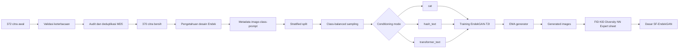

Alur tersebut dapat diringkas sebagai:

```text
Dataset
→ audit
→ deduplikasi
→ metadata T2I
→ train/validation/test split
→ balanced sampling
→ text encoding
→ conditional GAN training
→ generated evaluation
→ quantitative and visual analysis
```

---

# 2. Dataset Citra Endek

## 2.1 Struktur dataset

Dataset dikelompokkan ke dalam empat kategori motif.

```text
EndekGAN_Dataset/
├── flora/
├── fauna/
├── dekoratif/
└── geometris/
```

| Kategori | Karakter visual |
|---|---|
| Flora | Bunga, daun, sulur, dan bentuk organik |
| Fauna | Bentuk hewan yang telah mengalami stilasi |
| Dekoratif | Ornamen bebas dengan komposisi relatif kompleks |
| Geometris | Garis, bidang, simetri, dan struktur repetitif |

## 2.2 Validasi dan deduplikasi

Dataset awal terdiri atas 372 citra. Seluruh file dapat dibaca. Audit MD5 mendeteksi empat entri file yang termasuk ke dalam dua kelompok duplikasi identik.

Pada setiap kelompok, satu file dipertahankan dan salinan identik dihapus.

| Kategori | Data awal | Data valid | Data bersih | Perubahan |
|---|---:|---:|---:|---:|
| Flora | 148 | 148 | 147 | −1 |
| Fauna | 54 | 54 | 53 | −1 |
| Dekoratif | 112 | 112 | 112 | 0 |
| Geometris | 58 | 58 | 58 | 0 |
| **Total** | **372** | **372** | **370** | **−2** |

Deduplikasi dilakukan sebelum pembagian data untuk mencegah citra identik muncul pada subset training dan test secara bersamaan.

### Visualisasi audit dataset

[](4.2.1%20Validasi%2C%20Deduplikasi%2C%20dan%20Distribusi%20Kelas.png)

> Klik gambar untuk membukanya dalam ukuran penuh.

## 2.3 Heterogenitas visual

Setiap kategori memiliki heterogenitas visual yang berbeda.

Flora memuat bentuk organik, fauna memerlukan pembentukan struktur objek secara global, dekoratif mempunyai organisasi ornamen yang lebih bebas, sedangkan geometris menuntut ketepatan garis, simetri, dan repetisi.

[](4.2.2%20Heterogenitas%20visual%20antar-kategori.png)

Heterogenitas tersebut menjelaskan mengapa jumlah citra tidak selalu berhubungan linear dengan nilai FID atau KID.

---

# 3. Konstruksi Dataset Image–Text

## 3.1 Definisi dataset T2I

**Persamaan (1) — Dataset image–text**

```math
\mathcal{D}
=
\left\{
\left(
\mathbf{x}_i,
y_i,
t_i
\right)
\right\}_{i=1}^{N}
```

dengan:

- `x_i` sebagai citra Endek ke-`i`;
- `y_i` sebagai label kelas;
- `t_i` sebagai prompt;
- `N = 370`; dan
- `y_i ∈ {1,2,3,4}`.

Dataset citra biasa hanya mempunyai hubungan:

```text
image → class
```

Pada EndekGAN-T2I, struktur tersebut diperluas menjadi:

```text
image
→ class
→ title
→ full prompt
→ design attributes
→ cultural context
→ weavability constraint
```

## 3.2 Basis pengetahuan pakar

Prompt dibangun berdasarkan sembilan aspek penilaian desain Endek:

1. ide atau gagasan;
2. penguasaan teknis;
3. penguasaan bahan atau ragam hias;
4. kegunaan;
5. wujud atau *form*;
6. gaya atau corak;
7. kreativitas;
8. tempat atau konteks penggunaan; dan
9. selera, agama, serta kepantasan budaya.

Aspek tersebut dioperasionalkan menjadi delapan atribut T2I.

| Atribut | Peran |
|---|---|
| `label` | Menentukan kategori motif |
| `motif_source` | Menjelaskan objek atau simbol sumber |
| `technique` | Menjelaskan stilasi, deformasi, atau distorsi |
| `layout_pattern` | Menjelaskan organisasi spasial |
| `composition` | Menjelaskan prinsip komposisi |
| `color_style` | Memberikan arahan warna |
| `weavability_note` | Memberikan batasan teknis tenun |
| `cultural_context` | Menjaga identitas dan kepantasan budaya |

## 3.3 Template prompt

```text
Motif Endek [KELAS] berbasis [SUMBER MOTIF].

Desain kain Endek Bali bertema [KELAS] yang terinspirasi dari
[SUMBER MOTIF].

Motif dibuat menggunakan [DESKRIPSI TEKNIK].

Tata letak menggunakan [POLA], dengan [PRINSIP KOMPOSISI 1],
[PRINSIP KOMPOSISI 2], dan kesatuan ornamen.

Pewarnaan memakai [GAYA WARNA].

Desain harus [BATASAN WEAVABILITY], tetap mempertahankan tekstur
tenun ikat tradisional, dan [KONTEKS BUDAYA].
```

Contoh:

```text
Motif Endek Flora berbasis bunga kamboja sebagai simbol kesucian.
Motif dibuat menggunakan teknik distorsi dan pola acak terkontrol,
dengan keseimbangan visual, warna coklat, krem, dan emas, tekstur
tenun ikat tradisional, serta kepantasan motif dalam konteks Bali.
```

## 3.4 Struktur metadata

Setiap record menyimpan:

```text
filename
image_path
label
class_idx
md5
title
motif_source
technique
layout_pattern
composition
color_style
weavability_note
cultural_context
prompt
```

| Kelompok | Kolom | Fungsi |
|---|---|---|
| Identitas | `filename`, `image_path`, `md5` | Pelacakan citra dan audit duplikasi |
| Kategori | `label`, `class_idx` | Class embedding dan balanced sampling |
| Teks pendek | `title` | Calon eksperimen short-prompt |
| Teks panjang | `prompt` | Conditioning utama |
| Desain | `motif_source`, `technique`, `layout_pattern`, `composition` | Penyusunan prompt |
| Warna | `color_style` | Arahan palet |
| Teknik dan budaya | `weavability_note`, `cultural_context` | Batasan tenun dan budaya |

Dataset menghasilkan:

- 370 record citra;
- 369 prompt unik;
- satu prompt utama per citra;
- `title` sebagai teks pendek; dan
- `prompt` sebagai narasi lengkap.

[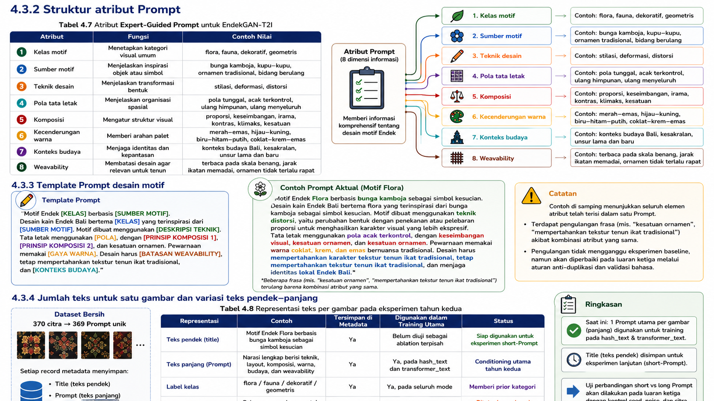](4.3.2-4.3.3-4.3.4.png)

## 3.5 Stable prompt construction

Atribut prompt dibentuk secara deterministik:

```text
label + filename
→ MD5 key
→ stable_choice
→ prompt attributes
```

Citra yang sama akan memperoleh prompt yang sama selama nama file, label, dan knowledge base tidak berubah.

Keterbatasan metadata saat ini:

- terdapat satu prompt identik pada dua citra;
- beberapa atribut komposisi dapat berulang;
- beberapa prompt memiliki frasa berulang; dan
- belum tersedia multi-caption untuk satu citra.

---

# 4. Konsep Text-to-Image pada EndekGAN-T2I

EndekGAN-T2I menerima tiga sinyal:

1. prompt `t`;
2. label kelas `y`; dan
3. noise laten `z`.

## 4.1 Text embedding

**Persamaan (2) — Text embedding**

```math
\mathbf{e}_t
=
E_{\mathrm{text}}(t),
\qquad
\mathbf{e}_t
\in
\mathbb{R}^{384}
```

## 4.2 Class embedding

**Persamaan (3) — Class embedding**

```math
\mathbf{e}_y
=
E_{\mathrm{class}}(y),
\qquad
\mathbf{e}_y
\in
\mathbb{R}^{64}
```

## 4.3 Condition projector

**Persamaan (4) — Condition vector**

```math
\mathbf{c}
=
P_{\phi}
\left(
\mathbf{e}_t
\mathbin{\Vert}
\mathbf{e}_y
\right),
\qquad
\mathbf{c}
\in
\mathbb{R}^{256}
```

Simbol `∥` menunjukkan konkatenasi text embedding dan class embedding.

## 4.4 Conditional generation

**Persamaan (5) — Generated image**

```math
\widehat{\mathbf{x}}
=
G_{\theta}
\left(
\mathbf{z},
\mathbf{c}
\right),
\qquad
\mathbf{z}
\sim
\mathcal{N}
\left(
\mathbf{0},
\mathbf{I}_{128}
\right)
```

Bentuk output generator:

```math
\widehat{\mathbf{x}}
\in
[-1,1]^{3\times256\times256}
```

Prompt mengarahkan distribusi visual, label memperkuat prior kategori, sedangkan noise memungkinkan satu prompt menghasilkan beberapa alternatif citra.

---

# 5. Pembagian Data Terstratifikasi

Dataset dibagi menggunakan rasio 80:10:10 setelah deduplikasi dan sebelum augmentasi.

| Kategori | Training | Validation | Test | Total |
|---|---:|---:|---:|---:|
| Flora | 118 | 15 | 14 | 147 |
| Fauna | 42 | 5 | 6 | 53 |
| Dekoratif | 90 | 11 | 11 | 112 |
| Geometris | 46 | 6 | 6 | 58 |
| **Total** | **296** | **37** | **37** | **370** |

File pembagian:

| File | Fungsi |
|---|---|
| `train_split.csv` | Record untuk optimisasi generator dan discriminator |
| `val_split.csv` | Record validation dan pemantauan sampel |
| `test_split.csv` | Record evaluasi FID/KID dan generated evaluation |

Jumlah test hanya 37 citra, yaitu 6–14 citra per kelas. Karena itu, FID/KID per kelas digunakan sebagai indikator diagnostik.

---

# 6. Class-Balanced Sampling

Distribusi training asli:

| Kategori | Data training | Proporsi asli |
|---|---:|---:|
| Flora | 118 | 39,86% |
| Fauna | 42 | 14,19% |
| Dekoratif | 90 | 30,41% |
| Geometris | 46 | 15,54% |

## 6.1 Jumlah sampel kelas

**Persamaan (6)**

```math
n_k
=
\sum_{i=1}^{N}
\mathbb{I}
\left(
y_i=k
\right)
```

## 6.2 Bobot per citra

**Persamaan (7)**

```math
\alpha_i
=
\frac{1}{n_{y_i}}
```

## 6.3 Probabilitas citra

**Persamaan (8)**

```math
p_i
=
\frac{\alpha_i}
{\sum_{j=1}^{N}\alpha_j}
```

## 6.4 Probabilitas kelas

**Persamaan (9)**

```math
P(Y=k)
=
\sum_{i:y_i=k}p_i
=
\frac{1}{K}
```

Karena terdapat empat kelas:

```math
P(Y=k)
=
0.25
```

## 6.5 Sampel efektif per epoch

Konfigurasi:

```python
num_samples = 296
batch_size = 16
drop_last = True
replacement = True
```

**Persamaan (10)**

```math
N_{\mathrm{eff}}
=
16
\left\lfloor
\frac{296}{16}
\right\rfloor
=
288
```

**Persamaan (11) — Ekspektasi paparan setiap kelas**

```math
\mathbb{E}[M_k]
=
\frac{N_{\mathrm{eff}}}{K}
=
\frac{288}{4}
=
72
```

Balanced sampling menyeimbangkan frekuensi paparan, tetapi tidak menambah jumlah citra unik pada kelas minoritas.

---

# 7. Prapemrosesan dan Augmentasi

## 7.1 Training transform

```text
Input image
→ RGB conversion
→ resize 256 × 256
→ horizontal flip, p = 0.50
→ ColorJitter, p = 0.30
→ tensor conversion
→ normalization [-1,1]
```

Parameter `ColorJitter`:

| Parameter | Nilai |
|---|---:|
| Brightness | 0,08 |
| Contrast | 0,08 |
| Saturation | 0,08 |
| Hue | 0,02 |

## 7.2 Validation dan test transform

```text
Input image
→ RGB conversion
→ resize 256 × 256
→ tensor conversion
→ normalization [-1,1]
```

Validation dan test tidak menggunakan transformasi acak.

Normalisasi:

```python
mean = [0.5, 0.5, 0.5]
std = [0.5, 0.5, 0.5]
```

Normalisasi tersebut menyesuaikan citra real dengan domain keluaran `tanh` generator.

---

# 8. Arsitektur EndekGAN-T2I

[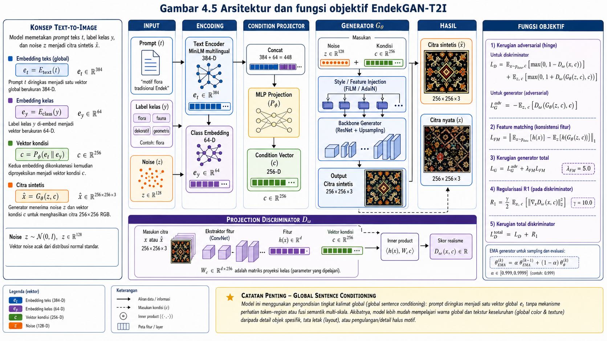](Gambar_4_5_Arsitektur_EndekGAN_T2I.png)

## 8.1 Dimensi representasi

| Komponen | Dimensi |
|---|---:|
| Noise laten | 128 |
| Text embedding | 384 |
| Class embedding | 64 |
| Konkatenasi text–class | 448 |
| Condition vector | 256 |
| Output image | 3 × 256 × 256 |

## 8.2 Generator

Generator menerima noise dan condition vector. Keduanya diproyeksikan menjadi fitur awal `4 × 4`, kemudian diperbesar menggunakan *transposed-convolution upsampling* hingga resolusi 256 × 256.

Output akhir menggunakan:

```python
nn.Tanh()
```

Jumlah parameter generator:

```text
6.171.299
```

## 8.3 Projection discriminator

Discriminator mengekstraksi fitur citra:

```math
\mathbf{h}
=
h_{\omega}(\mathbf{x})
```

**Persamaan (12) — Projection discriminator**

```math
D_{\omega}
\left(
\mathbf{x},
\mathbf{c}
\right)
=
a_{\omega}(\mathbf{h})
+
\left\langle
\mathbf{h},
V_{\omega}\mathbf{c}
\right\rangle
```

Komponen pertama menilai realisme citra. Komponen proyeksi menilai kompatibilitas antara fitur citra dan kondisi teks–kelas.

Jumlah parameter discriminator:

```text
7.295.713
```

---

# 9. Strategi Conditioning

| Mode | Implementasi | Informasi yang dipertahankan | Peran |
|---|---|---|---|
| `cat` | `MD5(label) → sparse 384-D vector` | Kategori; prompt diabaikan | Category-conditioned baseline |
| `hash_text` | Token → hash bin → L2 normalization | Bag-of-words | Lightweight text-guided baseline |
| `transformer_text` | Multilingual MiniLM → mean pooling → L2 normalization | Makna kalimat global | Baseline T2I utama |

## 9.1 `cat`

Mode `cat` menguji kemampuan model dalam mempelajari prior visual kategori tanpa menggunakan isi prompt. Mode ini bukan T2I penuh.

## 9.2 `hash_text`

Mode `hash_text` menggunakan token prompt, tetapi tidak mempertahankan urutan kata, hubungan sinonim, dan konteks kalimat secara menyeluruh.

## 9.3 `transformer_text`

Text encoder:

```text
sentence-transformers/paraphrase-multilingual-MiniLM-L12-v2
```

Konfigurasi:

```text
Maximum token : 160
Pooling       : mean pooling
Normalization : L2
Embedding     : 384-D
Fine-tuning   : tidak dilakukan
```

---

# 10. Fungsi Objektif

> Nomor persamaan ditulis di luar blok formula. Jangan menambahkan `\tag{...}` di dalam blok `math`.

## 10.1 Hinge loss discriminator

**Persamaan (13)**

```math
\begin{aligned}
\mathcal{L}_{D}^{\mathrm{hinge}}
={}&
\mathbb{E}_{(\mathbf{x},\mathbf{c})\sim p_{\mathrm{data}}}
\left[
\max
\left(
0,
1-D_{\omega}(\mathbf{x},\mathbf{c})
\right)
\right]
\\
&+
\mathbb{E}_{\mathbf{z}\sim p(\mathbf{z}),\,\mathbf{c}}
\left[
\max
\left(
0,
1+D_{\omega}(\widehat{\mathbf{x}},\mathbf{c})
\right)
\right]
\end{aligned}
```

## 10.2 Generator adversarial loss dan feature matching

**Persamaan (14)**

```math
\begin{aligned}
\mathcal{L}_{G}
={}&
-
\mathbb{E}_{\mathbf{z},\mathbf{c}}
\left[
D_{\omega}
\left(
\widehat{\mathbf{x}},
\mathbf{c}
\right)
\right]
\\
&+
\lambda_{\mathrm{FM}}
\left\|
\mathbb{E}_{\mathbf{x}}
\left[
\mathbf{h}(\mathbf{x})
\right]
-
\mathbb{E}_{\mathbf{z}}
\left[
\mathbf{h}(\widehat{\mathbf{x}})
\right]
\right\|_{1}
\end{aligned}
```

dengan:

```math
\lambda_{\mathrm{FM}}
=
5
```

## 10.3 R1 regularization

**Persamaan (15)**

```math
\mathcal{R}_{1}
=
\frac{\gamma}{2}
\mathbb{E}_{(\mathbf{x},\mathbf{c})\sim p_{\mathrm{data}}}
\left[
\left\|
\nabla_{\mathbf{x}}
D_{\omega}
\left(
\mathbf{x},
\mathbf{c}
\right)
\right\|_{2}^{2}
\right],
\qquad
\gamma
=
5
```

R1 diterapkan setiap 16 langkah menggunakan *lazy regularization*.

## 10.4 Exponential moving average

**Persamaan (16)**

```math
\boldsymbol{\theta}_{\mathrm{EMA}}^{(s)}
=
\beta
\boldsymbol{\theta}_{\mathrm{EMA}}^{(s-1)}
+
(1-\beta)
\boldsymbol{\theta}_{G}^{(s)},
\qquad
\beta
=
0.999
```

EMA generator digunakan untuk:

- sampel periodik;
- custom-prompt generation;
- generated evaluation; dan
- perhitungan metrik.

Loss L1 atau L2 piksel terhadap citra real acak tidak digunakan karena dataset tidak menyediakan pasangan target deterministik satu prompt–satu citra.

---

# 11. Konfigurasi Eksperimen

| Komponen | Nilai |
|---|---|
| Resolusi | 256 × 256 RGB |
| Batch size | 16 |
| Epoch | 400 |
| Latent dimension | 128 |
| Text embedding | 384 |
| Class embedding | 64 |
| Condition vector | 256 |
| Base channel | 32 |
| Parameter generator | 6.171.299 |
| Parameter discriminator | 7.295.713 |
| Learning rate generator | 0,0002 |
| Learning rate discriminator | 0,0001 |
| Optimizer | Adam |
| Adam β₁ | 0,0 |
| Adam β₂ | 0,999 |
| Feature matching | 5 |
| R1 gamma | 5 |
| R1 interval | 16 langkah |
| EMA decay | 0,999 |
| Seed | 42, 123, 2025 |
| Mode | `cat`, `hash_text`, `transformer_text` |

Total eksperimen:

```text
3 conditioning modes × 3 seeds = 9 runs
```

Seed juga digunakan pada pembagian dataset. Variasi antar-seed mencerminkan perubahan split, inisialisasi, noise, sampling, dan augmentasi.

---

# 12. Proses Training Step-by-Step

## Step 1 — Membaca batch

DataLoader mengambil:

```text
real image
label
class index
text embedding
prompt metadata
```

## Step 2 — Membentuk condition vector

```text
text embedding 384-D
+
class embedding 64-D
→ concatenation 448-D
→ condition projector
→ condition vector 256-D
```

## Step 3 — Sampling noise

```python
z = torch.randn(batch_size, 128)
```

## Step 4 — Menghasilkan fake image

```text
noise + condition
→ conditional generator
→ fake image [B, 3, 256, 256]
```

## Step 5 — Update discriminator

Discriminator menerima:

```text
real image + condition
fake image + condition
```

Discriminator diperbarui menggunakan hinge loss dan R1 secara berkala.

## Step 6 — Update generator

Generator diperbarui menggunakan:

```text
adversarial generator loss
+
feature-matching loss
```

## Step 7 — Update EMA

Bobot EMA diperbarui setelah optimizer generator dijalankan.

## Step 8 — Logging

Pada akhir setiap epoch, notebook menyimpan:

```text
g_loss
d_loss
fm_loss
r1
time_min
experiment_mode
```

ke `training_log.csv`.

## Step 9 — Menyimpan sampel

Sampel periodik dibuat menggunakan fixed prompt, fixed label, fixed noise, dan EMA generator.

## Step 10 — Menyimpan checkpoint

Checkpoint menyimpan:

```text
epoch
G state_dict
D state_dict
G_ema state_dict
optimizer_G state_dict
optimizer_D state_dict
configuration
experiment_mode
text embedding dimension
class names
parameter count
```

---

# 13. File CSV dan Artefak Eksperimen

## 13.1 Ringkasan file

| File | Kolom utama | Fungsi |
|---|---|---|
| `duplicates_md5_all.csv` | `filename`, `image_path`, `label`, `md5` | Daftar file duplikat MD5 |
| `clean_images_no_md5_duplicates.csv` | identitas citra, kelas, MD5 | Inventaris citra bersih |
| `metadata_expert_guided.csv` | citra, kelas, atribut, prompt | Dataset T2I utama |
| `metadata_expert_guided_used.csv` | metadata per run | Snapshot metadata yang digunakan |
| `train_split.csv` | seluruh field metadata | Reproduksi data training |
| `val_split.csv` | seluruh field metadata | Reproduksi data validation |
| `test_split.csv` | seluruh field metadata | Reproduksi data test |
| `training_log.csv` | epoch dan loss | Sumber grafik training |
| `generated_eval_index_<MODE>.csv` | generated path, prompt, label | Indeks generated image |
| `fid_kid_metrics_<MODE>.csv` | FID, KID, scope, kelas | Evaluasi distribusi |
| `lpips_diversity_<MODE>.csv` | LPIPS mean dan standard deviation | Diversity opsional |
| `nearest_neighbor_check_<MODE>.csv` | fake, real terdekat, MSE | Diagnostik memorisasi |
| `human_expert_evaluation_sheet_<MODE>.csv` | skor pakar | Instrumen evaluasi budaya |
| `custom_image_visual_stats_summary.csv` | entropy, sharpness, colourfulness, diversity | Statistik custom prompt |
| `experiment_summary_<MODE>.json` | konfigurasi run | Ringkasan reproduksibilitas |

## 13.2 `training_log.csv`

Kolom:

```text
epoch
g_loss
d_loss
fm_loss
r1
time_min
experiment_mode
```

| Kolom | Makna |
|---|---|
| `epoch` | Nomor epoch |
| `g_loss` | Total generator loss |
| `d_loss` | Hinge loss discriminator |
| `fm_loss` | Feature-matching loss |
| `r1` | R1 penalty |
| `time_min` | Waktu training kumulatif |
| `experiment_mode` | Mode conditioning |

## 13.3 `generated_eval_index_<MODE>.csv`

Kolom:

```text
label
generated_path
prompt
source_filename
experiment_mode
```

File ini menghubungkan generated image dengan kelas, prompt, file sumber, dan mode conditioning.

## 13.4 `fid_kid_metrics_<MODE>.csv`

Kolom:

```text
fid
kid_mean
kid_std
scope
label
n_real
n_fake
experiment_mode
```

`scope=per_class` digunakan untuk analisis utama.

## 13.5 `nearest_neighbor_check_<MODE>.csv`

Kolom:

```text
fake_path
nearest_real_path
mse_distance
label
```

Nilai `mse_distance` yang sangat kecil perlu diperiksa secara visual karena dapat menunjukkan kemiripan berlebihan dengan citra training.

## 13.6 `human_expert_evaluation_sheet_<MODE>.csv`

Kolom:

```text
score_ide_gagasan_1_5
score_penguasaan_teknis_1_5
score_ragam_hias_bahan_1_5
score_kegunaan_kain_1_5
score_wujud_form_1_5
score_gaya_corak_1_5
score_kreativitas_1_5
score_konteks_bali_1_5
score_selera_agama_kepantasan_1_5
score_semantic_alignment_1_5
score_repeat_consistency_1_5
score_woven_texture_1_5
score_weavability_1_5
expert_comment
```

File ini merupakan instrumen kosong. Skor pakar tidak boleh diklaim sebelum benar-benar diisi.

## 13.7 Text embedding cache

```text
train_<MODE>_embeddings.npy
train_<MODE>_index.csv
val_<MODE>_embeddings.npy
val_<MODE>_index.csv
test_<MODE>_embeddings.npy
test_<MODE>_index.csv
```

Embedding disimpan agar text encoder tidak dijalankan kembali pada setiap epoch.

---

# 14. Grafik Training

Notebook membaca `training_log.csv` dan membentuk grafik:

```text
Generator loss
Discriminator loss
Feature-matching loss
```

## 14.1 Kurva training

[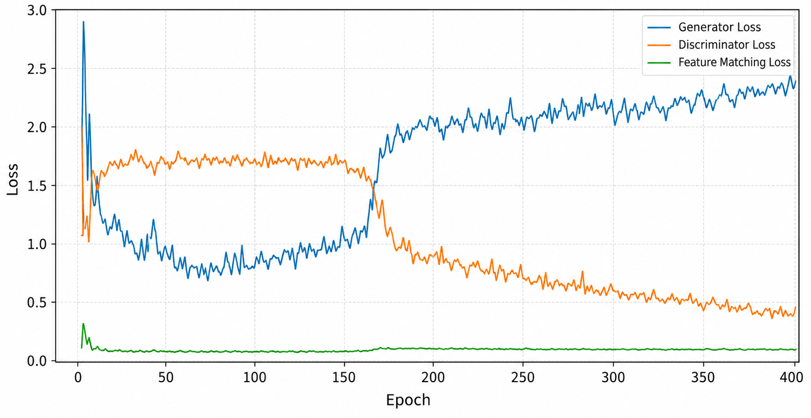](Gambar_4_6_Kurva_Training_Cat_Seed2025.png)

Kurva GAN tidak harus turun secara monoton. Grafik digunakan untuk mengamati:

- keseimbangan generator dan discriminator;
- kemungkinan dominasi salah satu jaringan;
- kestabilan feature-matching loss;
- lonjakan ekstrem; dan
- konsistensi antar-seed.

## 14.2 Membuat ulang grafik dari CSV

```python
import pandas as pd
import matplotlib.pyplot as plt

log_df = pd.read_csv("training_log.csv")

plt.figure(figsize=(10, 5))
plt.plot(
    log_df["epoch"],
    log_df["g_loss"],
    label="Generator loss"
)
plt.plot(
    log_df["epoch"],
    log_df["d_loss"],
    label="Discriminator loss"
)
plt.plot(
    log_df["epoch"],
    log_df["fm_loss"],
    label="Feature-matching loss"
)

plt.xlabel("Epoch")
plt.ylabel("Loss")
plt.title("EndekGAN-T2I Training Curves")
plt.legend()
plt.grid(True, alpha=0.3)
plt.tight_layout()
plt.savefig(
    "training_curves.png",
    dpi=300,
    bbox_inches="tight"
)
plt.show()
```

---

# 15. Evaluasi Validation dan Test

## 15.1 Mengapa tidak ada testing-loss curve?

EndekGAN-T2I bukan model klasifikasi yang mempunyai:

```text
train accuracy
validation accuracy
test accuracy
```

Pada eksperimen ini:

- training set digunakan untuk backpropagation;
- validation set digunakan untuk pemantauan sampel;
- test set digunakan setelah training untuk evaluasi generatif.

Karena itu, **grafik testing** yang benar adalah:

1. FID per kategori;
2. KID per kategori;
3. generated samples;
4. intra-prompt diversity;
5. nearest-neighbor analysis; dan
6. evaluasi pakar.

## 15.2 Fréchet Inception Distance

**Persamaan (17) — FID**

```math
\operatorname{FID}
=
\left\|
\boldsymbol{\mu}_{r}
-
\boldsymbol{\mu}_{g}
\right\|_{2}^{2}
+
\operatorname{Tr}
\left(
\boldsymbol{\Sigma}_{r}
+
\boldsymbol{\Sigma}_{g}
-
2
\left(
\boldsymbol{\Sigma}_{r}
\boldsymbol{\Sigma}_{g}
\right)^{1/2}
\right)
```

Nilai lebih rendah menunjukkan distribusi generated image lebih dekat dengan citra real.

[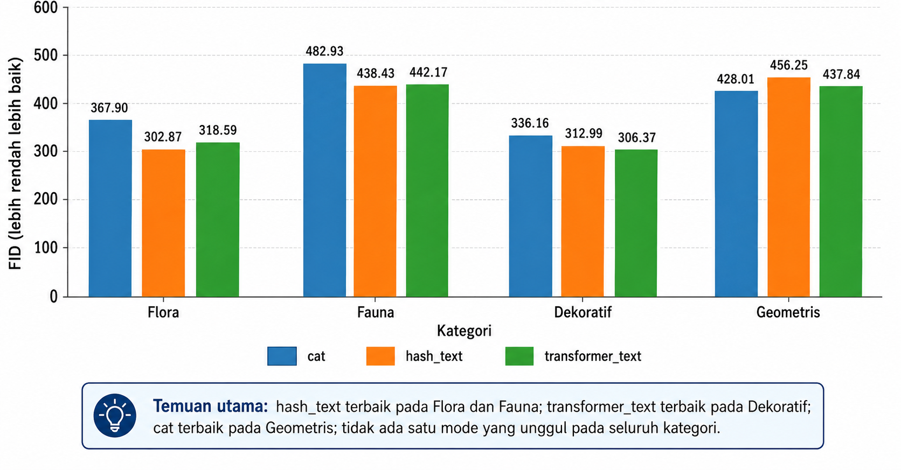](Gambar_4_13_FID_Per_Kategori.png)

## 15.3 Kernel Inception Distance

**Persamaan (18) — KID**

```math
\operatorname{KID}
=
\operatorname{MMD}^{2}
\left(
\mathcal{F}_{r},
\mathcal{F}_{g}
\right)
```

Nilai lebih rendah menunjukkan kedekatan distribusi yang lebih baik.

[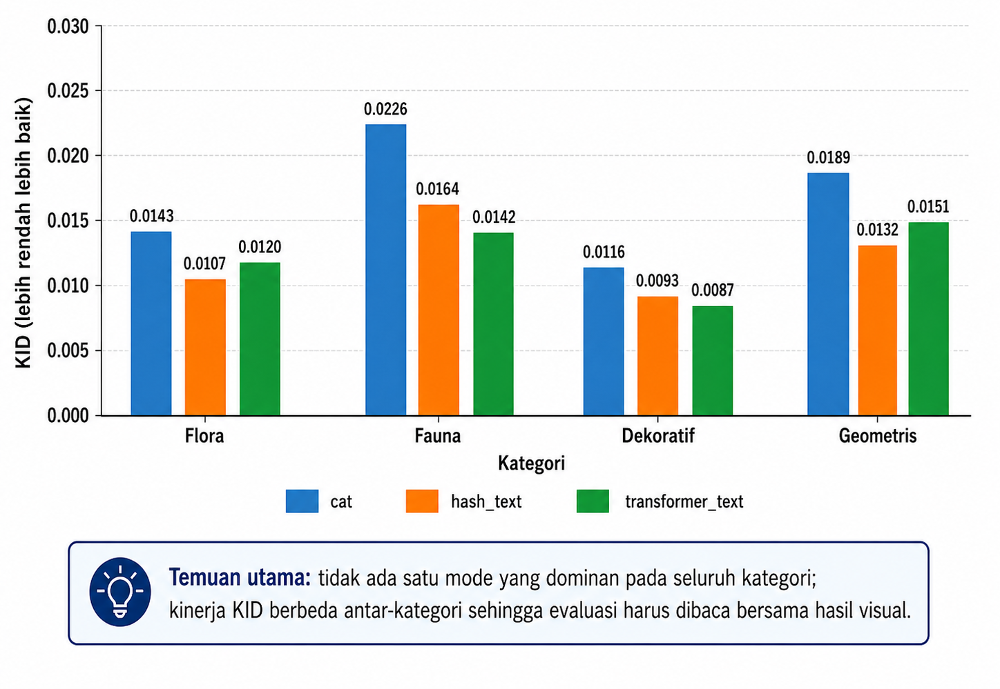](Gambar_4_14_KID_Per_Kategori.png)

## 15.4 Intra-prompt diversity

**Persamaan (19)**

```math
\operatorname{Diversity}
=
\frac{2}{m(m-1)}
\sum_{a<b}
\frac{
\left\|
\widehat{\mathbf{x}}_{a}
-
\widehat{\mathbf{x}}_{b}
\right\|_{2}^{2}
}{
3HW
}
```

Nilai lebih besar menunjukkan keluaran yang lebih beragam untuk prompt yang sama.

## 15.5 Nearest-neighbor distance

**Persamaan (20)**

```math
d
\left(
\widehat{\mathbf{x}},
\mathbf{x}_{j}
\right)
=
\frac{1}{3HW}
\left\|
\widehat{\mathbf{x}}
-
\mathbf{x}_{j}
\right\|_{2}^{2}
```

Nearest-neighbor analysis digunakan sebagai diagnostik memorisasi.

## 15.6 Membuat grafik FID dan KID dari CSV

```python
import pandas as pd
import matplotlib.pyplot as plt

files = {
    "cat": "fid_kid_metrics_cat.csv",
    "hash_text": "fid_kid_metrics_hash_text.csv",
    "transformer_text":
        "fid_kid_metrics_transformer_text.csv",
}

rows = []

for mode, path in files.items():
    df = pd.read_csv(path)
    df = df[df["scope"] == "per_class"].copy()
    df["mode"] = mode
    rows.append(df)

metrics = pd.concat(rows, ignore_index=True)

fid_table = metrics.pivot(
    index="label",
    columns="mode",
    values="fid"
)

kid_table = metrics.pivot(
    index="label",
    columns="mode",
    values="kid_mean"
)

fid_table.plot(
    kind="bar",
    figsize=(10, 5)
)

plt.ylabel("FID")
plt.xlabel("Kategori")
plt.title("FID per Kategori")
plt.xticks(rotation=0)
plt.tight_layout()
plt.savefig(
    "Gambar_4_13_FID_Per_Kategori.png",
    dpi=300,
    bbox_inches="tight"
)
plt.show()

kid_table.plot(
    kind="bar",
    figsize=(10, 5)
)

plt.ylabel("KID")
plt.xlabel("Kategori")
plt.title("KID per Kategori")
plt.xticks(rotation=0)
plt.tight_layout()
plt.savefig(
    "Gambar_4_14_KID_Per_Kategori.png",
    dpi=300,
    bbox_inches="tight"
)
plt.show()
```

---

# 16. Hasil Generasi

## 16.1 Mode `cat`

[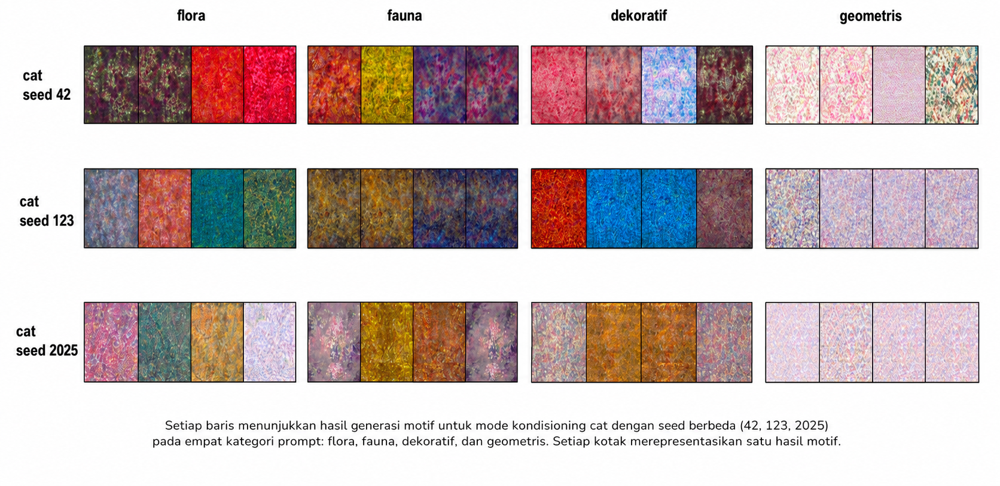](Gambar_4_7_Hasil_Cat_Seed42_123_2025.png)

Mode `cat` mempelajari warna dan tekstur berdasarkan kategori. Isi prompt tidak memengaruhi generated image.

## 16.2 Mode `hash_text`

[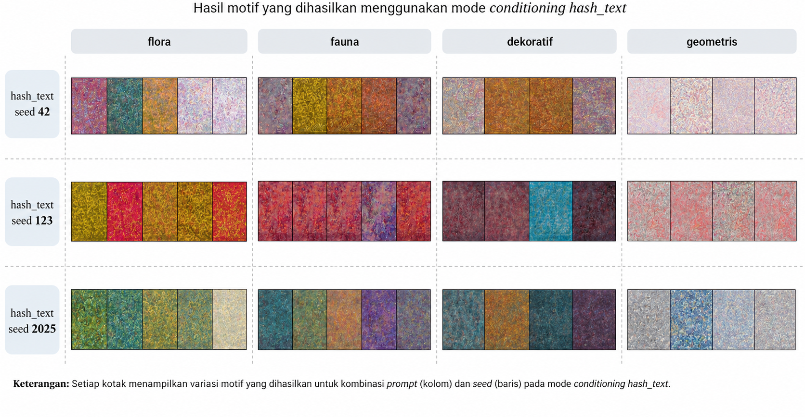](Gambar_4_8_Hasil_HashText_Seed42_123_2025.png)

Mode `hash_text` menggunakan token prompt, tetapi belum mempertahankan hubungan semantik antaratribut.

## 16.3 Mode `transformer_text`

[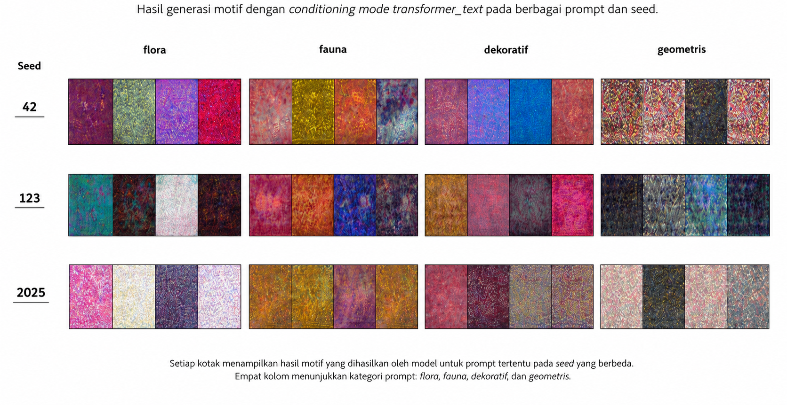](Gambar_4_9_Hasil_TransformerText_Seed42_123_2025.png)

Mode `transformer_text` memberikan representasi teks paling informatif dan menghasilkan variasi visual paling tinggi.

## 16.4 Perbandingan seluruh mode

[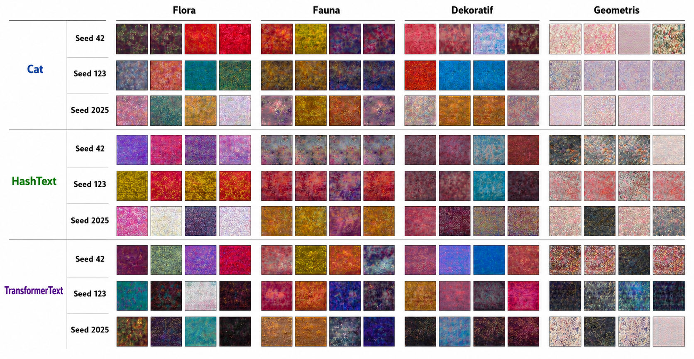](Gambar_4_10_Perbandingan_Cat_HashText_TransformerText_3Seed.png)

## 16.5 Contact sheet seluruh hasil

[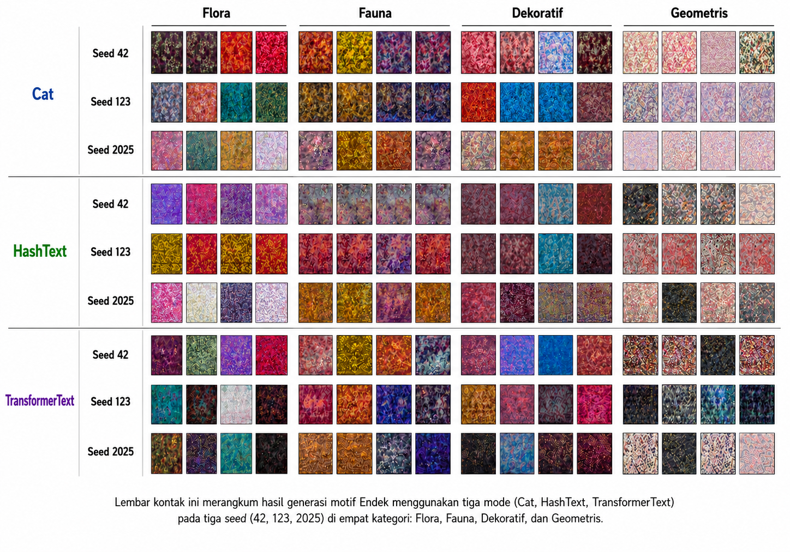](endekgan_contact_sheet_all_modes.png)

Secara visual, seluruh mode lebih kuat mempelajari warna dan tekstur global dibandingkan:

- batas ornamen;
- bentuk objek;
- simetri;
- konsistensi repetisi;
- hierarki ornamen; dan
- tekstur tenun mikro.

---

# 17. Ringkasan Hasil Kuantitatif

## 17.1 Loss 20 epoch terakhir

| Mode | G loss | D loss | FM loss |
|---|---:|---:|---:|
| `cat` | 2,1530 ± 0,2143 | 0,3962 ± 0,0965 | 0,0607 ± 0,0016 |
| `hash_text` | 2,3582 ± 0,0550 | 0,3665 ± 0,0316 | 0,0864 ± 0,0111 |
| `transformer_text` | **1,9998 ± 0,0720** | 0,4681 ± 0,0517 | 0,0644 ± 0,0026 |

## 17.2 FID per kategori

| Kategori | n real | `cat` | `hash_text` | `transformer_text` |
|---|---:|---:|---:|---:|
| Flora | 14 | 367,90 ± 20,95 | **302,87 ± 19,26** | 318,59 ± 18,58 |
| Fauna | 6 | 482,93 ± 90,09 | **438,43 ± 51,55** | 442,17 ± 52,00 |
| Dekoratif | 11 | 336,16 ± 18,74 | 312,99 ± 19,45 | **306,37 ± 10,97** |
| Geometris | 6 | **428,01 ± 61,11** | 456,25 ± 51,79 | 437,84 ± 48,93 |
| **Rata-rata kelas** | — | 403,75 | 377,64 | **376,24** |

Tidak terdapat satu mode yang unggul pada seluruh kategori.

## 17.3 KID per kategori

| Kategori | n real | `cat` | `hash_text` | `transformer_text` |
|---|---:|---:|---:|---:|
| Flora | 14 | 0,2624 ± 0,0601 | **0,1773 ± 0,0291** | 0,1784 ± 0,0146 |
| Fauna | 6 | 0,3863 ± 0,1669 | 0,3704 ± 0,0982 | **0,3288 ± 0,0699** |
| Dekoratif | 11 | 0,2521 ± 0,0348 | 0,2107 ± 0,0280 | **0,1850 ± 0,0042** |
| Geometris | 6 | 0,2829 ± 0,0699 | 0,3850 ± 0,0136 | **0,2679 ± 0,0198** |
| **Rata-rata kelas** | — | 0,2959 | 0,2858 | **0,2400** |

## 17.4 Statistik custom prompt

Evaluasi terbaru menggunakan:

```text
3 modes × 3 seeds × 4 categories × 4 images
= 144 generated images
```

| Mode | Entropy | Sharpness | Colourfulness | Intra-prompt diversity |
|---|---:|---:|---:|---:|
| `cat` | 6,0975 ± 0,2700 | 618,21 ± 509,13 | 39,10 ± 16,08 | 0,0456 ± 0,0338 |
| `hash_text` | **6,2361 ± 0,3273** | **647,02 ± 345,35** | **39,69 ± 15,05** | 0,0381 ± 0,0339 |
| `transformer_text` | 6,2016 ± 0,5011 | 639,84 ± 339,45 | 39,24 ± 16,38 | **0,0744 ± 0,0414** |

`transformer_text` menghasilkan intra-prompt diversity tertinggi.

## 17.5 Interpretasi utama

Hasil menunjukkan transisi berikut:

```text
category-to-image
→ lightweight text conditioning
→ semantic global text conditioning
```

Temuan utama:

1. `cat` memberikan kontrol kategori dasar.
2. `hash_text` membuktikan token prompt dapat memengaruhi generasi.
3. `transformer_text` memberikan representasi teks paling informatif.
4. `transformer_text` mempunyai generator loss paling konsisten.
5. `transformer_text` memperoleh rata-rata KID terendah.
6. `transformer_text` menghasilkan intra-prompt diversity tertinggi.
7. Tidak ada satu mode yang unggul pada seluruh FID kategori.
8. Global sentence conditioning belum cukup untuk mengontrol struktur spasial motif secara terperinci.

---

# 18. Batas Validitas dan Klaim

## 18.1 Klaim yang didukung

- dataset image–text berhasil dibentuk;
- tiga strategi conditioning berhasil dibandingkan;
- prompt memengaruhi generasi pada `hash_text` dan `transformer_text`;
- `transformer_text` merupakan baseline semantik paling menjanjikan;
- pipeline dapat dilacak dan direplikasi.

## 18.2 Klaim yang tidak dibuat

- model memahami seluruh makna budaya secara penuh;
- generated image telah siap ditenun;
- Transformer unggul mutlak pada seluruh kelas;
- FID/KID membuktikan kepantasan budaya;
- skor pakar telah tersedia;
- model mempunyai token–region alignment;
- model mempunyai semantic fusion multi-skala.

## 18.3 Keterbatasan

- dataset hanya terdiri atas 370 citra bersih;
- data test hanya 37 citra;
- jumlah test per kelas hanya 6–14;
- prompt dibentuk menggunakan template;
- satu gambar hanya mempunyai satu prompt utama;
- beberapa prompt mempunyai frasa berulang;
- Transformer dibekukan;
- balanced sampling tidak menambah citra unik;
- global conditioning belum mengendalikan layout;
- repetisi dan tekstur tenun mikro belum konsisten.

---

# 19. Menjalankan Eksperimen

## 19.1 Clone repository

```bash
git clone https://github.com/wiwik-instiki/EndekGAN-T2I.git
cd EndekGAN-T2I
```

## 19.2 Membuat environment

```bash
conda create -n endekgan_t2i python=3.10 -y
conda activate endekgan_t2i
```

## 19.3 Instalasi package

```bash
pip install torch torchvision torchaudio
pip install pandas numpy matplotlib pillow tqdm scikit-learn scipy
pip install transformers accelerate
pip install torchmetrics torch-fidelity
pip install jupyter ipykernel
```

Opsional:

```bash
pip install lpips
```

## 19.4 Mengatur path dataset

```python
from pathlib import Path

DATASET_ROOT = Path(
    r"D:\DISERTASI_S3\WIWIK\DATASET_L2\EndekGAN\EndekGAN_Dataset"
)
```

Ganti dengan lokasi dataset pada komputer yang digunakan.

## 19.5 Memilih mode dan seed

```python
EXPERIMENT_MODE = "transformer_text"
SEED = 42
```

Pilihan mode:

```text
cat
hash_text
transformer_text
```

Seed eksperimen:

```text
42
123
2025
```

## 19.6 Menjalankan notebook

```bash
jupyter notebook EndekGAN_ExpertKnowledge_TextGuided_IEEE_Experiment.ipynb
```

Kemudian pilih:

```text
Kernel → Restart & Run All
```

---

# 20. Struktur Folder Output

```text
outputs_EndekGAN_ExpertGuided_<MODE>_<RUN_ID>/
├── config.json
├── checkpoints/
│   ├── checkpoint_epoch_0050_<MODE>.pth
│   ├── checkpoint_epoch_0100_<MODE>.pth
│   └── ...
├── samples/
│   ├── epoch_0001_<MODE>_ema_True.png
│   ├── epoch_0010_<MODE>_ema_True.png
│   ├── custom_flora_<MODE>.png
│   ├── custom_fauna_<MODE>.png
│   ├── custom_dekoratif_<MODE>.png
│   └── custom_geometris_<MODE>.png
├── logs/
│   ├── metadata_expert_guided_used.csv
│   ├── train_split.csv
│   ├── val_split.csv
│   ├── test_split.csv
│   ├── training_log.csv
│   ├── training_curves_<MODE>.png
│   ├── generated_eval_index_<MODE>.csv
│   ├── fid_kid_metrics_<MODE>.csv
│   ├── lpips_diversity_<MODE>.csv
│   ├── nearest_neighbor_check_<MODE>.csv
│   ├── human_expert_evaluation_sheet_<MODE>.csv
│   └── experiment_summary_<MODE>.json
├── text_embedding_cache/
│   ├── train_<MODE>_embeddings.npy
│   ├── train_<MODE>_index.csv
│   ├── val_<MODE>_embeddings.npy
│   ├── val_<MODE>_index.csv
│   ├── test_<MODE>_embeddings.npy
│   └── test_<MODE>_index.csv
└── generated_eval/
    ├── flora/
    ├── fauna/
    ├── dekoratif/
    └── geometris/
```

---

# 21. Roadmap SF-EndekGAN

Pengembangan berikutnya diarahkan pada:

1. semantic fusion multi-skala;
2. token–region attention;
3. cross-attention;
4. contrastive text–image alignment;
5. mismatched prompt negatives;
6. repeat-consistency loss;
7. symmetry-aware regularization;
8. motif-aware augmentation;
9. multi-caption generation;
10. lexical variation;
11. validasi pakar;
12. evaluasi weavability;
13. generative precision and recall;
14. LPIPS;
15. bootstrap confidence interval; dan
16. pruning atau knowledge distillation.

---

# 22. Sitasi

```bibtex
@article{rahayu_endekgan_t2i,
  title   = {EndekGAN-T2I: An Expert-Guided Text-to-Image Conditional GAN Baseline for Balinese Endek Textile Motif Generation},
  author  = {Rahayu G, Ni Luh Wiwik Sri and Suciati, Nanik and Siahaan, Daniel Oranova},
  journal = {Manuscript prepared for IEEE Access},
  year    = {2026},
  note    = {Update volume, pages, and DOI after publication}
}
```

---

# 23. Penulis

**Ni Luh Wiwik Sri Rahayu G**  
Doctoral Program in Informatics  
Institut Teknologi Sepuluh Nopember, Surabaya, Indonesia

**Prof. Dr. Eng. Nanik Suciati, S.Kom., M.Kom.**  
Department of Informatics  
Institut Teknologi Sepuluh Nopember, Surabaya, Indonesia

**Prof. Daniel Oranova Siahaan, S.Kom., M.Sc., PD.Eng.**  
Department of Informatics  
Institut Teknologi Sepuluh Nopember, Surabaya, Indonesia

---

## Etika Penggunaan

Penggunaan dataset dan generated image harus memperhatikan:

- izin penggunaan citra;
- hak cipta;
- provenance dataset;
- kepantasan budaya;
- motif yang mempunyai makna sakral; dan
- validasi pakar sebelum keluaran dinyatakan sebagai desain Endek yang sah.
