# EndekGAN-T2I

## A Design-Knowledge-Conditioned Text-to-Image GAN Baseline for Limited-Data Balinese Endek Motif Generation

[](https://www.python.org/)
[](https://pytorch.org/)
[](#overview)
[](#scope-and-validity)
[](#dataset)

**EndekGAN-T2I** is a **design-knowledge-conditioned text-to-image GAN baseline** for limited-data Balinese Endek motif generation. The framework combines structured Endek design prompts, class embeddings, separate generator- and discriminator-side condition projectors, a conditional generator, and a projection discriminator.

The repository documents the experimental pipeline used to compare three conditioning strategies under a common generative backbone:

- `cat`: category-conditioned baseline with deterministic label encoding;
- `hash_text`: deterministic hash-based lexical conditioning; and
- `transformer_text`: multilingual transformer-based semantic conditioning.

The study is positioned as a **transparent empirical baseline for conditioning analysis**, not as a production-ready Endek design system. The generated outputs should be interpreted as preliminary Endek-like visual patterns rather than weaving-ready motifs.

> **Main experimental flow**  
> dataset curation → MD5 deduplication → structured prompt construction → stratified split → inverse-frequency sampling → conditioning representation → conditional GAN training → EMA sampling → visual and distributional evaluation → statistical analysis.

---

## Table of Contents

1. [Overview](#overview)
2. [Dataset](#dataset)
3. [Structured Prompt Construction](#structured-prompt-construction)
4. [Conditioning Representations](#conditioning-representations)
5. [Data Split, Preprocessing, and Balanced Sampling](#data-split-preprocessing-and-balanced-sampling)
6. [EndekGAN-T2I Architecture](#endekgan-t2i-architecture)
7. [Training Objectives](#training-objectives)
8. [Experimental Configuration](#experimental-configuration)
9. [Evaluation Protocol](#evaluation-protocol)
10. [Experimental Results](#experimental-results)
11. [Artifacts and Output Files](#artifacts-and-output-files)
12. [Scope and Validity](#scope-and-validity)
13. [Running the Experiment](#running-the-experiment)
14. [Repository Output Structure](#repository-output-structure)
15. [Future Work](#future-work)
16. [Citation](#citation)
17. [Authors](#authors)

---

# Overview

EndekGAN-T2I investigates whether structured lexical and multilingual semantic conditioning provides additional generative information beyond category-conditioned representation in a limited-data Balinese Endek setting.

The framework connects:

- Endek motif images;
- motif categories;
- structured design attributes;
- Indonesian-language prompts;
- class embeddings;
- text representations; and
- conditional adversarial generation.

```mermaid
flowchart LR
    A[372 initial images] --> B[Readability validation]
    B --> C[MD5 duplicate audit]
    C --> D[370 unique images]
    D --> E[Structured design-knowledge prompts]
    E --> F[Image-class-prompt metadata]
    F --> G[Stratified train/val/test split]
    G --> H[Inverse-frequency weighted sampling]
    H --> I{Conditioning representation}
    I --> I1[cat]
    I --> I2[hash_text]
    I --> I3[transformer_text]
    I1 --> J[EndekGAN-T2I training]
    I2 --> J
    I3 --> J
    J --> K[EMA generator]
    K --> L[Generated Endek-like samples]
    L --> M[Visual statistics + FID/KID + training diagnostics]
    M --> N[Friedman statistical analysis]
```



The three conditioning strategies are evaluated with seeds **42, 123, and 2025**, yielding **nine complete experimental runs**.

---

# Dataset

## Dataset composition

The internal Endek image collection contains four motif categories.

```text
EndekGAN_Dataset/
├── flora/
├── fauna/
├── dekoratif/
└── geometris/
```

The folder names above follow the original local dataset naming. In the manuscript, the categories are reported in English as **flora, fauna, decorative, and geometric**.

| Category | Raw images | Valid images | Final unique images |
|---|---:|---:|---:|
| Flora | 148 | 148 | 147 |
| Fauna | 54 | 54 | 53 |
| Decorative | 112 | 112 | 112 |
| Geometric | 58 | 58 | 58 |
| **Total** | **372** | **372** | **370** |

All 372 files passed image-readability validation. MD5 checking identified two exact duplicate pairs, and one redundant copy from each pair was removed before data partitioning.

The resulting dataset is imbalanced, with flora and decorative motifs represented more frequently than fauna and geometric motifs.

## Data availability

The original Endek images are retained in the internal research collection and are **not redistributed in this public repository because of source-ownership restrictions**.

The repository is intended to expose the experimental logic and derived research artifacts, including:

- metadata;
- split files;
- configuration files;
- generated samples;
- training logs; and
- aggregate evaluation results.

Accordingly, the repository should be treated as a **transparent and traceable experimental record**, not as a fully self-contained public image dataset.

---

# Structured Prompt Construction

## Design-knowledge schema

Each image is paired with a structured Indonesian-language prompt generated from a controlled Endek design-knowledge schema.

The prompt representation extends the motif category with the following attributes:

| Attribute | Role |
|---|---|
| `label` | Motif category |
| `motif_source` | Visual or symbolic motif source |
| `technique` | Stylization, deformation, or distortion |
| `layout_pattern` | Spatial organization |
| `composition` | Compositional principle |
| `color_style` | Colour tendency |
| `cultural_context` | Balinese cultural context |
| `weavability_note` | Weaving-related constraint |

The manuscript reports the following representative attribute groups:

| Attribute group | Representative values |
|---|---|
| Motif class | flora, fauna, decorative, geometric |
| Motif source | frangipani, butterfly, traditional ornament, geometric structure |
| Technique | stylization, deformation, distortion |
| Layout | single pattern, controlled random, grouped repetition, full repetition |
| Composition | proportion, balance, rhythm, contrast, unity |
| Colour style | red-gold, green-yellow, blue-black-white |
| Cultural context | Balinese identity, cultural appropriateness |
| Weavability | thread-scale readability, motif density, binding distance |

## Deterministic prompt generation

Attribute values are assigned deterministically using a string derived from the class label, filename, and attribute identifier.

```text
class label + filename + attribute identifier
→ MD5 digest
→ hexadecimal-to-integer conversion
→ modulo controlled vocabulary size
→ selected attribute value
```

For attribute group \(k\),

```math
a_{i,k}
=
V_k
\left[
\operatorname{Int}_{16}
\left(
\operatorname{MD5}(q_{i,k})
\right)
\bmod |V_k|
\right].
```

This procedure produces:

- **370 image-prompt pairs**;
- **369 unique prompt strings**.

The prompts are **deterministic design-knowledge conditions**. They are **not manually written image captions and are not individually expert-validated annotations**.

## Prompt language

The prompts supplied to the text-representation pipeline are generated in **Indonesian**. The manuscript provides an English translation of the template only for readability.

Example English translation:

```text
A Balinese Endek {class} motif inspired by {motif source}.
The motif is transformed using {technique} and organized through {layout},
emphasizing {composition}. The design applies {colour style},
reflects {cultural context}, and considers {weavability constraint}.
```

---

# Conditioning Representations

All three variants use the same main generator, discriminator, and optimization configuration.

## `cat`: category-conditioned baseline

The prompt content is ignored. A deterministic 384-dimensional sparse category representation is constructed from the class label using MD5 hashing.

```math
j_y
=
\operatorname{Int}_{16}
\left(
\operatorname{MD5}(y)
\right)
\bmod 384.
```

Because a trainable 64-dimensional class embedding is also used, this mode is described as a **category-conditioned baseline with deterministic label encoding**.

## `hash_text`: hash-based lexical conditioning

Prompt tokens are deterministically mapped into a 384-dimensional vector.

```math
j_k
=
\operatorname{Int}_{16}
\left(
\operatorname{MD5}(w_k)
\right)
\bmod 384.
```

Token counts are accumulated and L2-normalized.

This representation preserves lexical occurrence but does not explicitly preserve word order or semantic relations.

## `transformer_text`: multilingual transformer conditioning

The semantic variant uses the frozen multilingual sentence encoder:

```text
sentence-transformers/paraphrase-multilingual-MiniLM-L12-v2
```

Configuration:

```text
Embedding dimension : 384
Maximum length      : 160 tokens
Pooling             : masked mean pooling
Normalization       : L2
Fine-tuning         : disabled
```

The embeddings are precomputed before adversarial training.

---

# Data Split, Preprocessing, and Balanced Sampling

## Stratified split

After deduplication, each experimental seed performs a stratified 80:10:10 split.

| Category | Training | Validation | Test | Total |
|---|---:|---:|---:|---:|
| Flora | 118 | 15 | 14 | 147 |
| Fauna | 42 | 5 | 6 | 53 |
| Decorative | 90 | 11 | 11 | 112 |
| Geometric | 46 | 6 | 6 | 58 |
| **Total** | **296** | **37** | **37** | **370** |

Seeds:

```text
42
123
2025
```

Each seed controls:

- stratified data partitioning;
- parameter initialization;
- stochastic augmentation;
- weighted sampling; and
- latent-noise generation.

Therefore, the reported runs are **complete seed-specific experimental repetitions**, not repeated model initialization under one fixed split.

## Preprocessing

All images are:

```text
RGB conversion
→ direct resize to 256 × 256
→ tensor conversion
→ normalization to [-1, 1]
```

Training augmentation:

```text
Horizontal flip : p = 0.50
ColorJitter     : p = 0.30
Brightness      : 0.08
Contrast        : 0.08
Saturation      : 0.08
Hue             : 0.02
```

Validation and test transformations are deterministic.

## Inverse-frequency weighted sampling

For training sample \(i\),

```math
\alpha_i = \frac{1}{n_{y_i}}.
```

Sampling is performed with replacement using:

```text
num_samples = 296
batch_size  = 16
drop_last   = True
replacement = True
```

This produces:

```text
18 optimization batches per epoch
288 sampled observations per epoch
expected exposure ≈ 72 observations per class
```

Weighted sampling balances exposure frequency; it does **not** create new unique images for minority classes.

---

# EndekGAN-T2I Architecture

## Representation dimensions

| Component | Dimension |
|---|---:|
| Latent noise \(z\) | 128 |
| Text/category representation \(e_t\) | 384 |
| Class embedding \(e_y\) | 64 |
| Concatenated representation | 448 |
| Generator condition \(c_G\) | 256 |
| Discriminator condition \(c_D\) | 256 |
| Output image | 3 × 256 × 256 |

## Separate condition projectors

EndekGAN-T2I uses **separate generator- and discriminator-side condition projectors**:

```math
c_G=P_G([e_t;e_y]),
\qquad
c_D=P_D([e_t;e_y]).
```

This distinction is important: the implementation does **not** use a single shared condition projector.

## Conditional generator

```math
\widehat{x}
=
G(z,c_G),
\qquad
z\sim\mathcal{N}(0,I_{128}).
```

The concatenated latent-condition representation is projected into a 4×4 feature tensor and progressively upsampled to 256×256 using transposed-convolution blocks.

The final RGB output uses `tanh`.

Generator parameter count:

```text
6,171,299
```

## Projection discriminator

The discriminator uses spectrally normalized convolutional blocks and global sum pooling. Its score combines unconditional realism with conditional compatibility:

```math
D(x,t,y)
=
u^\top h(x)
+
\langle h(x),Vc_D\rangle.
```

Discriminator parameter count:

```text
7,295,713
```

---

# Training Objectives

## Discriminator hinge loss

```math
\mathcal{L}^{\mathrm{hinge}}_D
=
\mathbb{E}_{x,c}
\left[
\max(0,1-D(x,c))
\right]
+
\mathbb{E}_{z,c}
\left[
\max(0,1+D(\widehat{x},c))
\right].
```

## Generator adversarial loss

```math
\mathcal{L}^{\mathrm{adv}}_G
=
-\mathbb{E}_{z,c}
\left[
D(\widehat{x},c)
\right].
```

## Feature matching

```math
\mathcal{L}_{FM}
=
\left\|
\frac{1}{B}\sum_{i=1}^{B}h(x_i)
-
\frac{1}{B}\sum_{i=1}^{B}h(\widehat{x}_i)
\right\|_1.
```

The generator objective is

```math
\mathcal{L}_G
=
\mathcal{L}^{\mathrm{adv}}_G
+
5\mathcal{L}_{FM}.
```

## Lazy R1 regularization

```math
R_1
=
\frac{\gamma}{2}
\mathbb{E}
\left[
\|\nabla_xD(x,c)\|_2^2
\right],
\qquad
\gamma=5.
```

R1 is applied every 16 discriminator updates.

## Exponential moving average

```math
\theta^{(k)}_{EMA}
=
0.999\theta^{(k-1)}_{EMA}
+
0.001\theta^{(k)}_G.
```

The EMA generator is used for generated evaluation and sampling.

---

# Experimental Configuration

| Item | Configuration |
|---|---|
| Resolution | 256 × 256 RGB |
| Batch size | 16 |
| Epochs | 400 |
| Updates per run | 7,200 |
| Latent dimension | 128 |
| Text dimension | 384 |
| Class-embedding dimension | 64 |
| Condition dimension | 256 |
| Generator parameters | 6,171,299 |
| Discriminator parameters | 7,295,713 |
| Generator learning rate | \(2\times10^{-4}\) |
| Discriminator learning rate | \(1\times10^{-4}\) |
| Optimizer | Adam |
| Adam \(\beta_1,\beta_2\) | \(0, 0.999\) |
| Feature-matching weight | 5.0 |
| R1 coefficient / interval | 5.0 / 16 updates |
| EMA decay | 0.999 |
| Seeds | 42, 123, 2025 |
| Conditioning variants | `cat`, `hash_text`, `transformer_text` |

Total experimental runs:

```text
3 conditioning strategies × 3 seeds = 9 runs
```

---

# Evaluation Protocol

## Generated evaluation

The EMA generator produces:

```text
128 generated images per motif category
512 generated images per run
```

The principal quantitative comparison uses **class-wise FID and KID** with 2,048-dimensional Inception features.

Available real test images per class:

| Category | Real test images |
|---|---:|
| Flora | 14 |
| Fauna | 6 |
| Decorative | 11 |
| Geometric | 6 |

Because these counts are small, class-wise FID/KID values are interpreted as **exploratory diagnostics**, not definitive large-sample estimates.

## Descriptive visual statistics

The reported descriptive measures are:

- entropy;
- sharpness;
- colourfulness; and
- intra-prompt diversity MSE.

## Macro summaries

Macro FID and macro KID are computed by averaging the four class-wise values within each run.

These values are **macro-averaged class-wise metrics**, not global FID/KID.

## Statistical comparison

Differences among conditioning strategies are assessed using a Friedman test over the 12 seed-class blocks:

```text
FID : χ²(2) = 5.167, p = 0.0755
KID : χ²(2) = 4.167, p = 0.1245
```

Neither comparison reaches the conventional \(\alpha=0.05\) significance level.

## Incomplete / non-principal evaluations

The codebase also contains routines or artifacts for:

- pixel-space nearest-neighbor screening;
- LPIPS diversity; and
- domain-expert evaluation sheets.

However:

- nearest-neighbor screening is treated only as a preliminary memorization diagnostic;
- completed LPIPS scores are not reported in the paper;
- completed domain-expert scores are not available.

Therefore, the repository and manuscript do **not** claim completed expert validation or semantic/cultural correctness.

---

# Experimental Results

## Descriptive visual statistics

Evaluation across 144 generated samples:

```text
3 modes × 3 seeds × 4 categories × 4 images = 144 images
```

| Conditioning strategy | Entropy ↑ | Sharpness ↑ | Colourfulness ↑ | Intra-prompt diversity MSE ↑ |
|---|---:|---:|---:|---:|
| `cat` | 6.0975 ± 0.2700 | 618.21 ± 509.13 | 39.10 ± 16.08 | 0.0456 ± 0.0338 |
| `hash_text` | **6.2361 ± 0.3273** | **647.02 ± 345.35** | **39.69 ± 15.05** | 0.0381 ± 0.0339 |
| `transformer_text` | 6.2016 ± 0.5011 | 639.84 ± 339.45 | 39.24 ± 16.38 | **0.0744 ± 0.0414** |

`transformer_text` achieved approximately:

- **63.2% higher intra-prompt diversity than `cat`**; and
- **95.3% higher intra-prompt diversity than `hash_text`**.

This indicates greater visual variation under the same conditioning setting, but **does not independently establish semantic prompt-image alignment**.

## Class-wise FID

Lower is better.

| Category | `cat` | `hash_text` | `transformer_text` |
|---|---:|---:|---:|
| Flora | 367.90 ± 20.95 | **302.87 ± 19.26** | 318.59 ± 18.58 |
| Fauna | 482.93 ± 90.09 | **438.43 ± 51.55** | 442.17 ± 52.00 |
| Decorative | 336.16 ± 18.74 | 312.99 ± 19.45 | **306.37 ± 10.97** |
| Geometric | **428.01 ± 61.11** | 456.25 ± 51.79 | 437.84 ± 48.93 |

No conditioning strategy achieved the lowest FID in every motif category.

## Class-wise KID

Lower is better.

| Category | `cat` | `hash_text` | `transformer_text` |
|---|---:|---:|---:|
| Flora | 0.262 ± 0.060 | **0.177 ± 0.029** | 0.178 ± 0.015 |
| Fauna | 0.386 ± 0.167 | 0.370 ± 0.098 | **0.329 ± 0.070** |
| Decorative | 0.252 ± 0.035 | 0.211 ± 0.028 | **0.185 ± 0.004** |
| Geometric | 0.283 ± 0.070 | 0.385 ± 0.014 | **0.268 ± 0.020** |

## Macro-averaged class-wise results

| Variant | Macro FID ↓ | Inter-seed SD | Macro KID ↓ | Inter-seed SD |
|---|---:|---:|---:|---:|
| `cat` | 403.7510 | 35.3013 | 0.2959 | 0.0659 |
| `hash_text` | 377.6354 | **4.6340** | 0.2858 | **0.0095** |
| `transformer_text` | **376.2412** | 19.7734 | **0.2400** | 0.0186 |

`transformer_text` produced the lowest mean macro FID and KID, while `hash_text` produced the smallest inter-seed variability.

These differences are **descriptive**, because the Friedman tests did not establish statistically significant superiority.

## Final 20-epoch training losses

| Variant | Generator loss | Discriminator loss | Feature-matching loss | R1 penalty |
|---|---:|---:|---:|---:|
| `cat` | 2.1530 ± 0.2143 | 0.3962 ± 0.0965 | 0.0607 ± 0.0016 | 0.00182 ± 0.00019 |
| `hash_text` | 2.3582 ± 0.0550 | 0.3665 ± 0.0316 | 0.0864 ± 0.0111 | 0.00162 ± 0.00010 |
| `transformer_text` | 1.9998 ± 0.0720 | 0.4681 ± 0.0517 | 0.0644 ± 0.0026 | 0.00177 ± 0.00018 |

All nine runs completed 400 epochs without non-finite values or abrupt numerical termination.

Training loss should not be interpreted as a direct ranking of generated-image quality.

## Qualitative findings

Across the three conditioning strategies, the model learned:

- broad colour distributions;
- local texture;
- preliminary textile-like appearance.

The generated outputs remained limited in:

- clearly bounded ornament formation;
- class-specific structure;
- stable geometric organization;
- repeat consistency; and
- woven-like microtexture.

The outputs should therefore be interpreted as **preliminary Endek-like visual patterns**, not final weaving-ready Endek designs.

---

# Artifacts and Output Files

Representative experiment artifacts include:

| File | Purpose |
|---|---|
| `duplicates_md5_all.csv` | Duplicate audit |
| `clean_images_no_md5_duplicates.csv` | Clean-image inventory |
| `metadata_expert_guided.csv` | Structured metadata and prompt records |
| `metadata_expert_guided_used.csv` | Metadata snapshot used by a run |
| `train_split.csv` | Training split |
| `val_split.csv` | Validation split |
| `test_split.csv` | Test split |
| `training_log.csv` | Epoch-level loss history |
| `generated_eval_index_<MODE>.csv` | Generated evaluation index |
| `fid_kid_metrics_<MODE>.csv` | FID/KID output |
| `nearest_neighbor_check_<MODE>.csv` | Preliminary pixel-space memorization diagnostic |
| `human_expert_evaluation_sheet_<MODE>.csv` | Empty expert-evaluation instrument |
| `experiment_summary_<MODE>.json` | Run configuration summary |

> **Legacy filename note:**  
> Some implementation artifacts retain names such as `metadata_expert_guided.csv`, `EndekGAN_ExpertKnowledge_TextGuided_IEEE_Experiment.ipynb`, or output folders containing `ExpertGuided`. These are legacy implementation names preserved to avoid breaking the existing experimental pipeline. They **do not imply that each prompt or generated sample was individually expert-authored or expert-validated**.

---

# Scope and Validity

## Supported claims

The current experiments support the following statements:

- a 370-image, four-category Endek image-prompt dataset was constructed for controlled experimentation;
- three conditioning representations were compared under a common conditional-GAN configuration;
- all nine runs completed the planned 400-epoch training schedule;
- `transformer_text` achieved the highest measured intra-prompt diversity;
- `transformer_text` achieved the lowest mean macro-averaged class-wise FID and KID;
- `hash_text` showed the lowest inter-seed variability in the macro distributional metrics;
- conditioning effects were not uniform across motif categories;
- Friedman tests did not establish statistically significant superiority among the three strategies.

## Claims not made

This repository does **not** claim that:

- `transformer_text` is statistically superior to all alternatives;
- the model fully understands Balinese cultural meaning;
- FID or KID proves cultural appropriateness;
- the generated motifs are weaving-ready;
- fine-grained text-image semantic alignment has been established;
- expert evaluation has been completed;
- LPIPS evaluation has been completed;
- the model provides token-region alignment;
- the model provides explicit repeat-aware structural control.

## Main limitations

- only 370 unique images are available;
- only 37 test images are available;
- each class contains only 6–14 real test samples;
- prompts are deterministically generated from controlled vocabularies;
- 370 image-prompt pairs contain 369 unique prompts;
- the multilingual transformer is frozen;
- balanced sampling does not increase the number of unique minority-class images;
- global conditioning does not explicitly constrain spatial repetition;
- semantic prompt compliance is not directly measured;
- domain-expert evaluation is not completed;
- ornament formation, repeat consistency, and woven-like microtexture remain limited.

---

# Running the Experiment

## 1. Clone the repository

```bash
git clone https://github.com/wiwik-instiki/EndekGAN-T2I.git
cd EndekGAN-T2I
```

## 2. Create an environment

```bash
conda create -n endekgan_t2i python=3.10 -y
conda activate endekgan_t2i
```

## 3. Install dependencies

```bash
pip install torch torchvision torchaudio
pip install pandas numpy matplotlib pillow tqdm scikit-learn scipy
pip install transformers sentence-transformers accelerate
pip install torchmetrics torch-fidelity
pip install jupyter ipykernel
```

Optional diagnostic dependency:

```bash
pip install lpips
```

## 4. Configure the dataset path

The original images are not distributed in the repository. Users with authorized access to the dataset should configure their local dataset path.

```python
from pathlib import Path

DATASET_ROOT = Path("/path/to/EndekGAN_Dataset")
```

Do not rely on the original development-machine path shown in historical notebook versions.

## 5. Select the conditioning mode and seed

```python
EXPERIMENT_MODE = "transformer_text"
SEED = 42
```

Available modes:

```text
cat
hash_text
transformer_text
```

Experimental seeds:

```text
42
123
2025
```

## 6. Run the notebook

The current implementation may retain the legacy notebook filename:

```bash
jupyter notebook EndekGAN_ExpertKnowledge_TextGuided_IEEE_Experiment.ipynb
```

Then run the notebook from a clean kernel.

Because the original images are not publicly redistributed, reproducing the complete training pipeline requires authorized access to the Endek image collection.

---

# Repository Output Structure

The existing implementation may retain legacy folder and file names.

```text
outputs_EndekGAN_ExpertGuided_<MODE>_<RUN_ID>/
├── config.json
├── checkpoints/
├── samples/
├── logs/
│   ├── metadata_expert_guided_used.csv
│   ├── train_split.csv
│   ├── val_split.csv
│   ├── test_split.csv
│   ├── training_log.csv
│   ├── generated_eval_index_<MODE>.csv
│   ├── fid_kid_metrics_<MODE>.csv
│   ├── nearest_neighbor_check_<MODE>.csv
│   ├── human_expert_evaluation_sheet_<MODE>.csv
│   └── experiment_summary_<MODE>.json
├── text_embedding_cache/
└── generated_eval/
    ├── flora/
    ├── fauna/
    ├── dekoratif/
    └── geometris/
```

The Indonesian folder labels `dekoratif` and `geometris` correspond to the manuscript categories **decorative** and **geometric**.

---

# Future Work

Future development should focus on the limitations identified by the present experiments rather than assuming the current baseline is a final Endek generation system.

Priority directions include:

1. a fixed common data partition for architecture-level comparisons;
2. cleaned and expert-validated prompts;
3. domain-expert evaluation of generated outputs;
4. longer training and expanded limited-data analysis;
5. explicit text-image alignment metrics;
6. repeat-aware structural constraints;
7. motif-identity and symmetry-aware objectives;
8. improved modelling of woven-like microtexture;
9. multi-caption or linguistically varied prompt construction;
10. perceptual diversity evaluation such as LPIPS;
11. stronger memorization diagnostics;
12. bootstrap confidence intervals and additional paired statistical analysis.

---

# Citation

If you use the repository, please cite the associated manuscript:

```bibtex
@article{Rahayu2026EndekGANT2I,
  title   = {EndekGAN-T2I: A Design-Knowledge-Conditioned Text-to-Image GAN Baseline for Limited-Data Balinese Endek Motif Generation},
  author  = {Rahayu G, Ni Luh Wiwik Sri and Suciati, Nanik and Siahaan, Daniel Oranova},
  journal = {Manuscript prepared for IEEE Access},
  year    = {2026},
  note    = {Update volume, pages, and DOI after publication}
}
```

---

# Authors

**Ni Luh Wiwik Sri Rahayu G**  
Doctoral Program in Informatics  
Institut Teknologi Sepuluh Nopember (ITS), Surabaya, Indonesia

**Nanik Suciati**  
Department of Informatics  
Institut Teknologi Sepuluh Nopember (ITS), Surabaya, Indonesia

**Daniel Oranova Siahaan**  
Department of Informatics  
Institut Teknologi Sepuluh Nopember (ITS), Surabaya, Indonesia

---

# Ethical and Cultural Use

Use of the dataset, metadata, and generated outputs should consider:

- image ownership and permissions;
- copyright;
- dataset provenance;
- cultural appropriateness;
- potentially sacred or culturally sensitive motifs; and
- domain-expert validation before any generated output is described as an authentic or weaving-ready Endek design.

---

## Research status

**EndekGAN-T2I is a research baseline for controlled conditioning analysis in limited-data Balinese Endek generation. It is not an autonomous cultural-design system and is not presented as a production-ready textile generator.**
