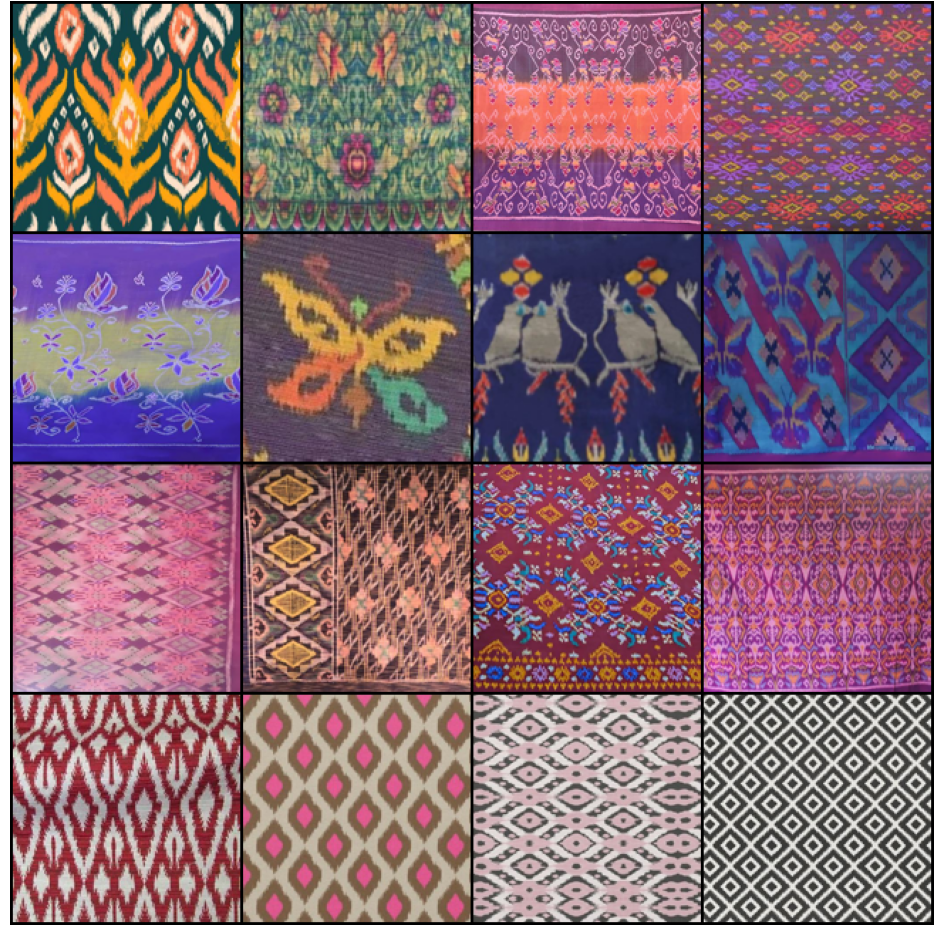
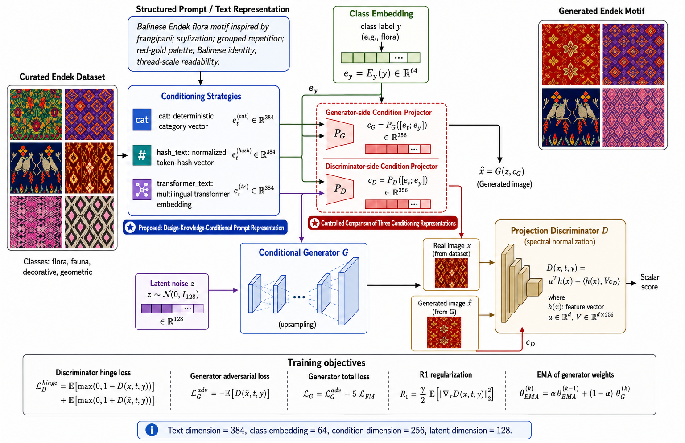
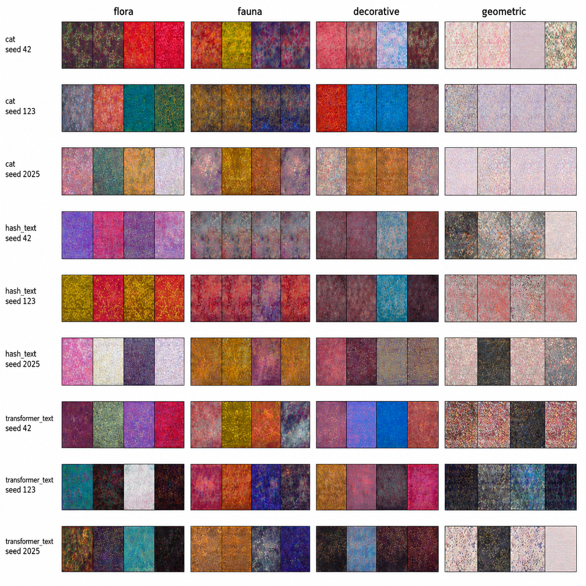
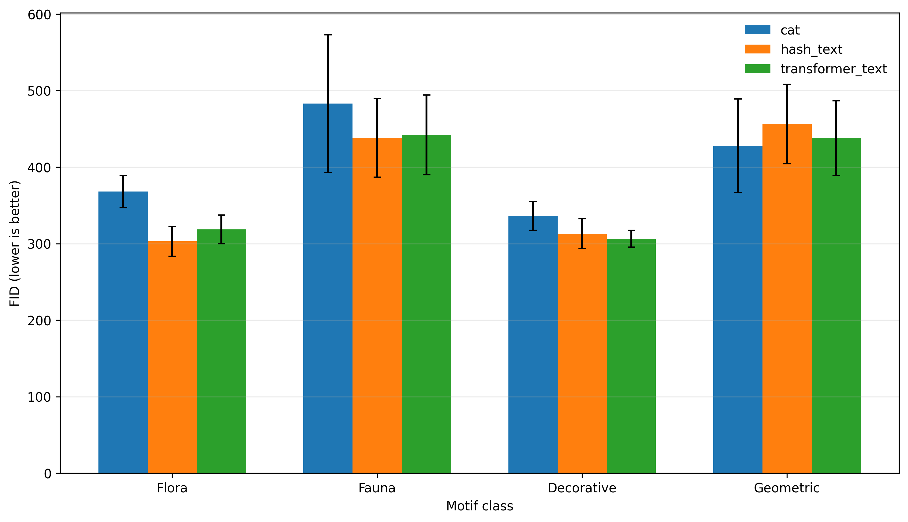
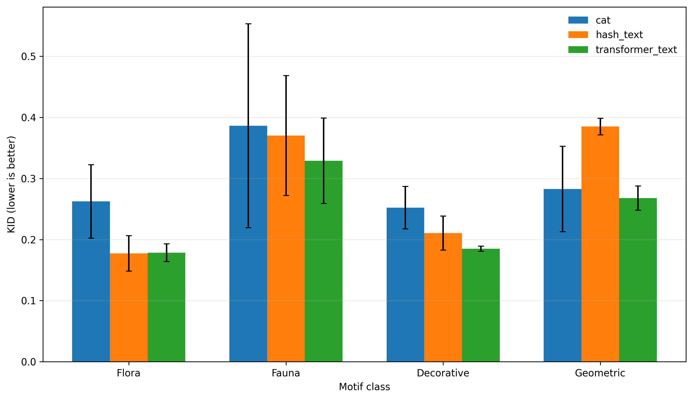
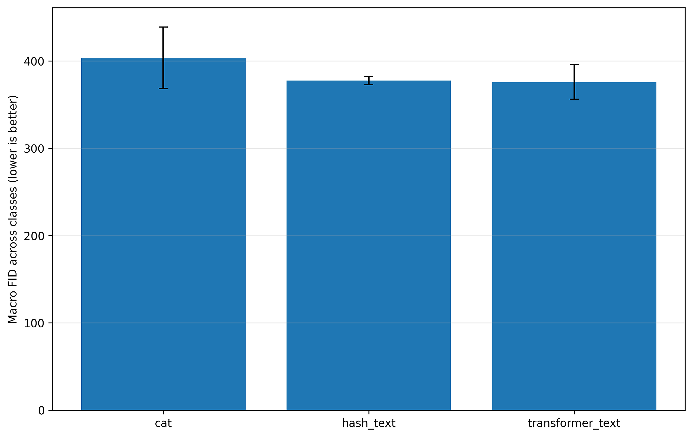
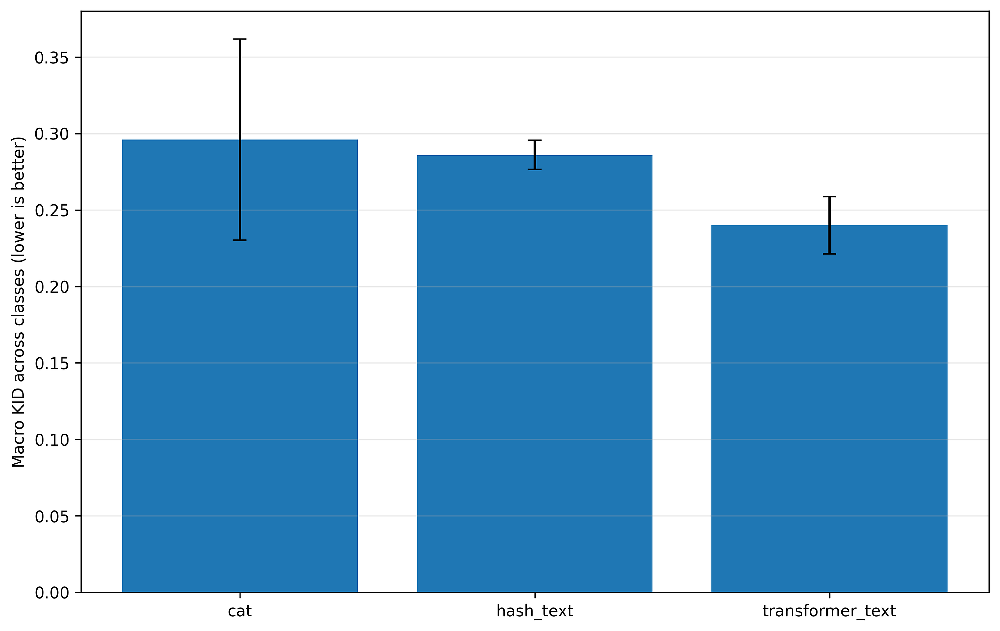
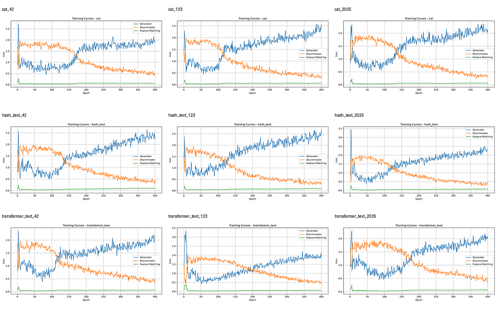

# EndekGAN-T2I

## A Design-Knowledge-Conditioned Text-to-Image GAN Baseline for Limited-Data Balinese Endek Motif Generation

[](https://www.python.org/)
[](https://pytorch.org/)
[](#research-objective)
[](#scope-validity-and-limitations)
[](#dataset)

**EndekGAN-T2I** is a **design-knowledge-conditioned text-to-image GAN baseline** for limited-data Balinese Endek motif generation. The framework combines structured Endek design prompts, class embeddings, separate generator- and discriminator-side condition projectors, a conditional generator, and a projection discriminator.

The repository documents the experimental pipeline used to compare three conditioning representations under a common conditional-GAN configuration:

- `cat`: category-conditioned baseline with deterministic label encoding;
- `hash_text`: deterministic hash-based lexical conditioning; and
- `transformer_text`: multilingual transformer-based semantic conditioning.

The study is positioned as a **transparent empirical baseline for conditioning analysis**, not as an autonomous or production-ready Endek design system. Generated outputs are interpreted as preliminary Endek-like visual patterns rather than weaving-ready motifs.

---

## Table of Contents

1. [Research Objective](#research-objective)
2. [Dataset](#dataset)
3. [Structured Prompt Construction](#structured-prompt-construction)
4. [Data Partitioning, Preprocessing, and Balanced Sampling](#data-partitioning-preprocessing-and-balanced-sampling)
5. [Conditioning Representations](#conditioning-representations)
6. [EndekGAN-T2I Architecture](#endekgan-t2i-architecture)
7. [Training Objectives](#training-objectives)
8. [Experimental Configuration](#experimental-configuration)
9. [Evaluation Protocol](#evaluation-protocol)
10. [Experimental Results](#experimental-results)
11. [Training Behaviour](#training-behaviour)
12. [Artifacts and Legacy Filenames](#artifacts-and-legacy-filenames)
13. [Scope, Validity, and Limitations](#scope-validity-and-limitations)
14. [Running the Experiment](#running-the-experiment)
15. [Future Work](#future-work)
16. [Citation](#citation)
17. [Authors](#authors)

---

# Research Objective

The central research question is:

> **To what extent do structured lexical and multilingual semantic conditioning representations provide additional generative information beyond category-conditioned representation for limited-data Balinese Endek motif generation?**

The complete experimental workflow is:

```mermaid
flowchart LR
    A[372 initial Endek images] --> B[Image-readability validation]
    B --> C[MD5 duplicate audit]
    C --> D[370 unique images]
    D --> E[Structured design-knowledge prompt construction]
    E --> F[Image-class-prompt metadata]
    F --> G[Stratified train/validation/test split]
    G --> H[Inverse-frequency weighted sampling]
    H --> I{Conditioning representation}
    I --> I1[cat]
    I --> I2[hash_text]
    I --> I3[transformer_text]
    I1 --> J[EndekGAN-T2I training]
    I2 --> J
    I3 --> J
    J --> K[EMA generator]
    K --> L[Generated Endek-like samples]
    L --> M[Visual statistics and class-wise FID/KID]
    M --> N[Macro summaries and Friedman test]
```



Three conditioning representations are evaluated using seeds **42**, **123**, and **2025**, resulting in **nine complete experimental runs**.

---

# Dataset

## Dataset composition

The initial collection contained **372 JPEG images** organized into four motif categories. All images passed readability validation. Exact duplicates were identified using MD5 hashes.

For image \(x_i\):

```math
m_i = \mathrm{MD5}(x_i).
```

Two exact duplicate pairs were identified; one redundant file from each pair was removed.

| Category | Raw images | Valid images | Final unique images |
|---|---:|---:|---:|
| Flora | 148 | 148 | 147 |
| Fauna | 54 | 54 | 53 |
| Decorative | 112 | 112 | 112 |
| Geometric | 58 | 58 | 58 |
| **Total** | **372** | **372** | **370** |

The final dataset is imbalanced, with flora and decorative motifs represented more frequently than fauna and geometric motifs.

<p align="center">
  
</p>

<p align="center"><b>Figure 1.</b> Representative samples from the flora, fauna, decorative, and geometric categories.</p>

## Public-data limitation

The original Endek images are retained in the internal research collection and are **not redistributed in this public repository because of source-ownership restrictions**.

The repository therefore exposes derived research artifacts such as metadata, split files, experiment configurations, generated samples, training logs, and aggregate evaluation results.

This repository should be interpreted as a **transparent and traceable experimental record**, not as a fully self-contained public image dataset.

---

# Structured Prompt Construction

Each image is paired with a **structured Indonesian-language prompt** derived from a controlled Endek design-knowledge schema.

| Attribute | Role |
|---|---|
| `label` | motif category |
| `motif_source` | visual or symbolic source |
| `technique` | stylization, deformation, or distortion |
| `layout_pattern` | spatial organization |
| `composition` | compositional principle |
| `color_style` | colour tendency |
| `cultural_context` | Balinese cultural context |
| `weavability_note` | weaving-related constraint |

Representative controlled values include:

| Attribute group | Examples |
|---|---|
| Motif class | flora, fauna, decorative, geometric |
| Motif source | frangipani, butterfly, traditional ornament, geometric structure |
| Technique | stylization, deformation, distortion |
| Layout | single pattern, controlled random, grouped repetition, full repetition |
| Composition | proportion, balance, rhythm, contrast, unity |
| Colour style | red-gold, green-yellow, blue-black-white |
| Cultural context | Balinese identity, cultural appropriateness |
| Weavability | thread-scale readability, motif density, binding distance |

## Deterministic attribute selection

Let \(V_k\) denote the controlled vocabulary for attribute group \(k\), and let \(q_{i,k}\) be the deterministic string constructed from the class label, filename, and attribute identifier.

```math
a_{i,k}
=
V_k\!\left[
\mathrm{Int}_{16}\!\left(
\mathrm{MD5}(q_{i,k})
\right)
\bmod |V_k|
\right].
```

Here, \(\mathrm{Int}_{16}(\cdot)\) denotes conversion of the hexadecimal MD5 digest into an integer.

This procedure produced:

- **370 image-prompt pairs**;
- **369 unique structured prompt strings**.

The prompts are **deterministic design-knowledge conditions**. They are **not manually written image captions and are not individually expert-validated annotations**.

## Prompt language

The actual prompts supplied to the text-representation pipeline are generated in **Indonesian**. The following is an English translation for readability:

```text
A Balinese Endek {class} motif inspired by {motif source}.
The motif is transformed using {technique} and organized through {layout},
emphasizing {composition}. The design applies {colour style},
reflects {cultural context}, and considers {weavability constraint}.
```

---

# Data Partitioning, Preprocessing, and Balanced Sampling

## Stratified split

After deduplication, the dataset is partitioned using an **80:10:10 stratified split**.

| Category | Training | Validation | Test | Total |
|---|---:|---:|---:|---:|
| Flora | 118 | 15 | 14 | 147 |
| Fauna | 42 | 5 | 6 | 53 |
| Decorative | 90 | 11 | 11 | 112 |
| Geometric | 46 | 6 | 6 | 58 |
| **Total** | **296** | **37** | **37** | **370** |

Each seed controls:

- stratified data partitioning;
- parameter initialization;
- stochastic augmentation;
- weighted sampling; and
- latent-noise generation.

Therefore, the reported runs are **complete seed-specific experimental repetitions**, not repeated model initialization under one fixed data split.

## Image preprocessing

All images are processed as:

```text
RGB conversion
→ direct resize to 256 × 256
→ tensor conversion
→ normalization to [-1, 1]
```

Training-only augmentation:

```text
Horizontal flip : p = 0.50
ColorJitter     : p = 0.30
Brightness      : 0.08
Contrast        : 0.08
Saturation      : 0.08
Hue             : 0.02
```

Validation and test preprocessing is deterministic.

## Inverse-frequency weighted sampling

For training sample \(i\), let \(n_{y_i}\) denote the number of training images belonging to its class.

```math
\alpha_i = \frac{1}{n_{y_i}}.
```

Sampling is performed with replacement. With 296 training records, batch size 16, and `drop_last=True`:

```math
N_{\mathrm{eff}}
=
16
\left\lfloor
\frac{296}{16}
\right\rfloor
=
288.
```

With four classes, the expected class exposure per epoch is:

```math
\mathbb{E}[M_k]
=
\frac{N_{\mathrm{eff}}}{4}
=
72.
```

Weighted sampling balances exposure frequency; it does **not** create additional unique minority-class images.

---

# Conditioning Representations

All three variants retain the same main generator, discriminator, and optimization configuration within a seed.

## 1. `cat`: category-conditioned baseline

The `cat` variant ignores prompt content and constructs a deterministic 384-dimensional sparse category representation. The category position is:

```math
j_y
=
\mathrm{Int}_{16}\!\left(
\mathrm{MD5}(y)
\right)
\bmod 384.
```

The corresponding 384-dimensional vector contains one non-zero entry at \(j_y\).

Because the model also uses a trainable 64-dimensional class embedding, this variant is described as a **category-conditioned baseline with deterministic label encoding**.

## 2. `hash_text`: hash-based lexical conditioning

Each prompt token \(w_k\) is deterministically mapped into one of 384 bins:

```math
j_k
=
\mathrm{Int}_{16}\!\left(
\mathrm{MD5}(w_k)
\right)
\bmod 384.
```

Let \(\widetilde{e}_t\) denote the accumulated token-count vector. The final lexical representation is L2-normalized:

```math
e_t^{(\mathrm{hash})}
=
\frac{\widetilde{e}_t}
{\left\|\widetilde{e}_t\right\|_2+\varepsilon}.
```

This representation captures lexical occurrence but does not explicitly model word order or semantic relationships.

## 3. `transformer_text`: multilingual transformer conditioning

The semantic variant uses the frozen multilingual model:

```text
sentence-transformers/paraphrase-multilingual-MiniLM-L12-v2
```

Configuration:

```text
Embedding dimension : 384
Maximum length      : 160 tokens
Pooling             : masked mean pooling
Normalization       : L2
Fine-tuning         : disabled
```

Let \(h_j\) denote token embedding \(j\), and \(m_j\in\{0,1\}\) its attention-mask value. Masked mean pooling is:

```math
\bar{e}_t
=
\frac{
\sum_{j=1}^{L} m_j h_j
}{
\sum_{j=1}^{L} m_j
}.
```

The pooled representation is then normalized:

```math
e_t^{(\mathrm{tr})}
=
\frac{\bar{e}_t}
{\left\|\bar{e}_t\right\|_2+\varepsilon}.
```

Transformer parameters remain frozen, and the text embeddings are computed before adversarial training.

---

# EndekGAN-T2I Architecture

The architecture contains:

- a 384-dimensional text/category representation \(e_t\);
- a trainable 64-dimensional class embedding \(e_y\);
- separate generator- and discriminator-side condition projectors;
- a 128-dimensional latent vector \(z\);
- a conditional generator \(G\); and
- a projection discriminator \(D\).

| Component | Dimension |
|---|---:|
| Latent noise \(z\) | 128 |
| Text/category representation \(e_t\) | 384 |
| Class embedding \(e_y\) | 64 |
| Concatenated text-class representation | 448 |
| Generator condition \(c_G\) | 256 |
| Discriminator condition \(c_D\) | 256 |
| Generated RGB image | 3 × 256 × 256 |

## Separate condition projectors

```math
c_G = P_G([e_t;e_y]),
\qquad
c_D = P_D([e_t;e_y]),
```

with

```math
c_G,c_D \in \mathbb{R}^{256}.
```

## Conditional generation

```math
z \sim \mathcal{N}(0,I_{128}),
```

and

```math
\widehat{x} = G(z,c_G).
```

The concatenated latent-condition vector is projected into a \(4\times4\) feature tensor and progressively upsampled to \(256\times256\). The final RGB output uses `tanh`.

Generator parameter count:

```text
6,171,299
```

## Projection discriminator

Let \(h(x)\in\mathbb{R}^{512}\) denote the image representation produced by the discriminator after convolutional feature extraction and global sum pooling.

```math
D(x,t,y)
=
u^\top h(x)
+
\left\langle
h(x),
V c_D
\right\rangle.
```

The first term represents unconditional realism, while the projection term represents image-condition compatibility.

Discriminator parameter count:

```text
7,295,713
```

<p align="center">
  
</p>

<p align="center"><b>Figure 2.</b> EndekGAN-T2I architecture showing the structured prompt representation, class embedding, separate condition projectors, conditional generator, projection discriminator, and training objectives.</p>

---

# Training Objectives

## Discriminator hinge loss

```math
\mathcal{L}^{\mathrm{hinge}}_D
=
\mathbb{E}_{x,t,y}
\left[
\max\left(0,1-D(x,t,y)\right)
\right]
+
\mathbb{E}_{z,t,y}
\left[
\max\left(0,1+D(\widehat{x},t,y)\right)
\right].
```

The generated sample is:

```math
\widehat{x}=G(z,c_G),
```

while the discriminator uses the discriminator-side condition \(c_D=P_D([e_t;e_y])\).

## Generator adversarial loss

```math
\mathcal{L}^{\mathrm{adv}}_G
=
-
\mathbb{E}_{z,t,y}
\left[
D(\widehat{x},t,y)
\right].
```

## Feature-matching loss

Let \(B\) denote the batch size and \(h(\cdot)\) the discriminator feature representation.

```math
\mathcal{L}_{FM}
=
\left\|
\frac{1}{B}\sum_{i=1}^{B}h(x_i)
-
\frac{1}{B}\sum_{i=1}^{B}h(\widehat{x}_i)
\right\|_1.
```

The complete generator objective is:

```math
\mathcal{L}_G
=
\mathcal{L}^{\mathrm{adv}}_G
+
5\mathcal{L}_{FM}.
```

## Lazy R1 regularization

The unscaled R1 term is:

```math
R_1
=
\frac{\gamma}{2}
\mathbb{E}_{x,t,y}
\left[
\left\|
\nabla_x D(x,t,y)
\right\|_2^2
\right],
\qquad
\gamma=5.
```

R1 is evaluated every **16 discriminator updates** using lazy regularization. On an R1 update, the implementation scales the regularization contribution by the interval to preserve its expected strength across updates.

## Exponential moving average

```math
\theta_{\mathrm{EMA}}^{(k)}
=
0.999\,\theta_{\mathrm{EMA}}^{(k-1)}
+
0.001\,\theta_G^{(k)}.
```

The EMA generator is used for sampling and evaluation.

---

# Experimental Configuration

| Item | Configuration |
|---|---|
| Resolution | 256 × 256 RGB |
| Batch size | 16 |
| Epochs | 400 |
| Optimization batches per epoch | 18 |
| Updates per run | 7,200 |
| Latent dimension | 128 |
| Text dimension | 384 |
| Class-embedding dimension | 64 |
| Condition dimension | 256 |
| Generator parameters | 6,171,299 |
| Discriminator parameters | 7,295,713 |
| Generator learning rate | \(2\times10^{-4}\) |
| Discriminator learning rate | \(1\times10^{-4}\) |
| Optimizer | Adam |
| Adam \((\beta_1,\beta_2)\) | \((0,0.999)\) |
| Feature-matching weight | 5.0 |
| R1 coefficient | 5.0 |
| R1 interval | every 16 discriminator updates |
| EMA decay | 0.999 |
| Seeds | 42, 123, 2025 |
| Conditioning variants | `cat`, `hash_text`, `transformer_text` |

Total experiment count:

```text
3 conditioning strategies × 3 seeds = 9 runs
```

---

# Evaluation Protocol

## Generated evaluation

For each trained run, the EMA generator produces:

```text
128 generated images per motif category
× 4 motif categories
= 512 generated images per run
```

Available real test images:

| Category | Real test images |
|---|---:|
| Flora | 14 |
| Fauna | 6 |
| Decorative | 11 |
| Geometric | 6 |

Because only 6-14 real test images are available per class, class-wise FID and KID values are interpreted as **exploratory diagnostics**, not definitive large-sample estimates.

## Fréchet Inception Distance

For real-feature mean and covariance \((\mu_r,\Sigma_r)\) and generated-feature mean and covariance \((\mu_g,\Sigma_g)\):

```math
\mathrm{FID}
=
\left\|
\mu_r-\mu_g
\right\|_2^2
+
\mathrm{Tr}
\left(
\Sigma_r+\Sigma_g
-
2
\left(
\Sigma_r\Sigma_g
\right)^{1/2}
\right).
```

Lower FID indicates smaller feature-distribution distance.

## Kernel Inception Distance

KID is the squared maximum mean discrepancy between real and generated Inception-feature distributions:

```math
\mathrm{KID}
=
\mathrm{MMD}^2
\left(
\mathcal{F}_r,
\mathcal{F}_g
\right).
```

Lower KID indicates smaller distributional discrepancy.

## Intra-prompt diversity

For \(m\) images generated under the same conditioning setting:

```math
\mathrm{Diversity}
=
\frac{2}{m(m-1)}
\sum_{a<b}
\frac{
\left\|
\widehat{x}_a-\widehat{x}_b
\right\|_2^2
}{
3HW
}.
```

Higher values indicate greater output variation under the same conditioning setting. This measure does **not** independently establish semantic prompt-image correspondence.

## Macro-averaged class-wise metrics

For a class-wise metric \(M_k\):

```math
M_{\mathrm{macro}}
=
\frac{1}{4}
\sum_{k=1}^{4}M_k.
```

The reported macro FID and macro KID are therefore **unweighted averages of class-wise metrics**, not pooled global FID/KID.

## Friedman statistical test

The conditioning strategies are compared across **12 seed-class blocks**.

```text
FID : χ²(2) = 5.167, p = 0.0755
KID : χ²(2) = 4.167, p = 0.1245
```

Neither test reaches the conventional significance threshold \(\alpha=0.05\).

## Evaluations not claimed as completed

The implementation also contains routines or files related to nearest-neighbor screening, LPIPS diversity, and domain-expert evaluation. However:

- nearest-neighbor screening is used only as a preliminary memorization diagnostic;
- completed LPIPS results are not reported;
- completed domain-expert scores are not available.

The repository therefore does **not** claim completed expert validation, cultural validation, or direct semantic-alignment evaluation.

---

# Experimental Results

## Generated Endek-like samples

<p align="center">
  
</p>

<p align="center"><b>Figure 3.</b> Multi-seed comparison of generated Endek-like samples across the <code>cat</code>, <code>hash_text</code>, and <code>transformer_text</code> conditioning strategies.</p>

Across the nine runs, the model generated colour-rich and textured outputs with visible variation across latent samples and experimental seeds. However, clearly bounded ornaments, stable geometric structures, regular repetitions, and woven-like microtexture were not consistently formed.

## Descriptive visual statistics

The current evaluation summarizes **144 generated samples**:

```text
3 conditioning strategies
× 3 seeds
× 4 motif categories
× 4 images
= 144 generated images
```

| Conditioning strategy | Entropy ↑ | Sharpness ↑ | Colourfulness ↑ | Intra-prompt diversity MSE ↑ |
|---|---:|---:|---:|---:|
| `cat` | 6.0975 ± 0.2700 | 618.21 ± 509.13 | 39.10 ± 16.08 | 0.0456 ± 0.0338 |
| `hash_text` | **6.2361 ± 0.3273** | **647.02 ± 345.35** | **39.69 ± 15.05** | 0.0381 ± 0.0339 |
| `transformer_text` | 6.2016 ± 0.5011 | 639.84 ± 339.45 | 39.24 ± 16.38 | **0.0744 ± 0.0414** |

`transformer_text` achieved approximately **63.2% higher intra-prompt diversity than `cat`** and **95.3% higher than `hash_text`**.

These differences indicate greater visual variation but do not independently prove semantic prompt-image alignment.

## Class-wise FID

<p align="center">
  
</p>

<p align="center"><b>Figure 4.</b> Class-wise FID across seeds 42, 123, and 2025. Lower values indicate smaller feature-distribution distance.</p>

| Category | `cat` | `hash_text` | `transformer_text` |
|---|---:|---:|---:|
| Flora | 367.90 ± 20.95 | **302.87 ± 19.26** | 318.59 ± 18.58 |
| Fauna | 482.93 ± 90.09 | **438.43 ± 51.55** | 442.17 ± 52.00 |
| Decorative | 336.16 ± 18.74 | 312.99 ± 19.45 | **306.37 ± 10.97** |
| Geometric | **428.01 ± 61.11** | 456.25 ± 51.79 | 437.84 ± 48.93 |

No conditioning strategy achieved the lowest FID across all motif categories.

## Class-wise KID

<p align="center">
  
</p>

<p align="center"><b>Figure 5.</b> Class-wise KID across seeds 42, 123, and 2025. Lower values indicate smaller distributional discrepancy.</p>

| Category | `cat` | `hash_text` | `transformer_text` |
|---|---:|---:|---:|
| Flora | 0.262 ± 0.060 | **0.177 ± 0.029** | 0.178 ± 0.015 |
| Fauna | 0.386 ± 0.167 | 0.370 ± 0.098 | **0.329 ± 0.070** |
| Decorative | 0.252 ± 0.035 | 0.211 ± 0.028 | **0.185 ± 0.004** |
| Geometric | 0.283 ± 0.070 | 0.385 ± 0.014 | **0.268 ± 0.020** |

The conditioning effect is therefore category dependent.

## Macro-averaged class-wise FID

<p align="center">
  
</p>

<p align="center"><b>Figure 6.</b> Macro-averaged class-wise FID for the three conditioning strategies.</p>

## Macro-averaged class-wise KID

<p align="center">
  
</p>

<p align="center"><b>Figure 7.</b> Macro-averaged class-wise KID for the three conditioning strategies.</p>

| Variant | Macro FID ↓ | Inter-seed SD | Macro KID ↓ | Inter-seed SD |
|---|---:|---:|---:|---:|
| `cat` | 403.7510 | 35.3013 | 0.2959 | 0.0659 |
| `hash_text` | 377.6354 | **4.6340** | 0.2858 | **0.0095** |
| `transformer_text` | **376.2412** | 19.7734 | **0.2400** | 0.0186 |

`transformer_text` achieved the lowest mean macro FID and KID, whereas `hash_text` showed the smallest inter-seed variability.

The Friedman tests did not establish statistically significant superiority among the three strategies.

---

# Training Behaviour

<p align="center">
  
</p>

<p align="center"><b>Figure 8.</b> Generator, discriminator, and feature-matching loss trajectories for the nine experimental runs.</p>

All nine runs completed 400 epochs without non-finite values or abrupt numerical termination.

Final-stage losses were summarized over the final 20 epochs:

| Variant | Generator loss | Discriminator loss | Feature-matching loss | R1 penalty |
|---|---:|---:|---:|---:|
| `cat` | 2.1530 ± 0.2143 | 0.3962 ± 0.0965 | 0.0607 ± 0.0016 | 0.00182 ± 0.00019 |
| `hash_text` | 2.3582 ± 0.0550 | 0.3665 ± 0.0316 | 0.0864 ± 0.0111 | 0.00162 ± 0.00010 |
| `transformer_text` | 1.9998 ± 0.0720 | 0.4681 ± 0.0517 | 0.0644 ± 0.0026 | 0.00177 ± 0.00018 |

These values characterize optimization behaviour and should **not** be interpreted as direct rankings of generated-image quality.

---

# Artifacts and Legacy Filenames

Representative artifacts include:

| Artifact | Purpose |
|---|---|
| `duplicates_md5_all.csv` | exact-duplicate audit |
| `clean_images_no_md5_duplicates.csv` | clean-image inventory |
| `metadata_expert_guided.csv` | structured image-class-prompt metadata |
| `metadata_expert_guided_used.csv` | metadata snapshot used by a run |
| `train_split.csv` | training split |
| `val_split.csv` | validation split |
| `test_split.csv` | test split |
| `training_log.csv` | epoch-level loss history |
| `generated_eval_index_<MODE>.csv` | generated-evaluation index |
| `fid_kid_metrics_<MODE>.csv` | class-wise FID/KID results |
| `nearest_neighbor_check_<MODE>.csv` | preliminary pixel-space memorization diagnostic |
| `human_expert_evaluation_sheet_<MODE>.csv` | empty expert-evaluation instrument |
| `experiment_summary_<MODE>.json` | run configuration summary |

> **Legacy filename note:** Some files and folders retain historical names containing `expert_guided`, `ExpertKnowledge`, or `ExpertGuided`. These names are preserved to avoid breaking the existing experimental pipeline. They do **not** mean that individual prompts or generated samples were expert-authored or expert-validated.

---

# Scope, Validity, and Limitations

## Supported claims

The current experiments support the following statements:

- a four-category Endek image-prompt dataset containing 370 unique images was constructed for controlled experimentation;
- the dataset contains 369 unique structured prompts;
- three conditioning representations were compared under a common conditional-GAN configuration;
- all nine seed-specific runs completed the 400-epoch schedule;
- `transformer_text` achieved the highest measured intra-prompt diversity;
- `transformer_text` achieved the lowest mean macro-averaged class-wise FID and KID;
- `hash_text` showed the lowest inter-seed variability in the macro metrics;
- conditioning performance varied across motif categories;
- Friedman tests did not establish statistically significant superiority.

## Claims not made

This repository does **not** claim that:

- `transformer_text` is statistically superior to every alternative;
- the model fully understands Balinese cultural meaning;
- FID or KID establishes semantic compliance or cultural appropriateness;
- generated outputs are weaving-ready Endek designs;
- fine-grained prompt-image semantic alignment has been established;
- domain-expert evaluation has been completed;
- LPIPS evaluation has been completed;
- the model provides token-region semantic alignment;
- the model provides explicit repeat-aware structural control.

## Main limitations

- 370 unique images;
- 37 total test images;
- 6-14 real test images per motif category;
- deterministic prompt generation from controlled vocabularies;
- 370 image-prompt pairs but 369 unique prompt strings;
- one primary prompt per image;
- frozen multilingual transformer;
- weighted sampling does not increase minority-class image diversity;
- limited explicit spatial control;
- no completed direct text-image alignment metric;
- no completed domain-expert evaluation;
- incomplete ornament formation and repeat consistency;
- limited woven-like microtexture.

---

# Running the Experiment

## 1. Clone

```bash
git clone https://github.com/wiwik-instiki/EndekGAN-T2I.git
cd EndekGAN-T2I
```

## 2. Create the environment

```bash
conda create -n endekgan_t2i python=3.10 -y
conda activate endekgan_t2i
```

## 3. Install dependencies

```bash
pip install torch torchvision torchaudio
pip install pandas numpy matplotlib pillow tqdm scikit-learn scipy
pip install transformers sentence-transformers accelerate
pip install torchmetrics torch-fidelity
pip install jupyter ipykernel
```

Optional:

```bash
pip install lpips
```

## 4. Configure the local dataset path

The original Endek images are not publicly redistributed. Authorized users should configure their own local path:

```python
from pathlib import Path

DATASET_ROOT = Path("/path/to/EndekGAN_Dataset")
```

## 5. Select conditioning mode and seed

```python
EXPERIMENT_MODE = "transformer_text"
SEED = 42
```

Available modes:

```text
cat
hash_text
transformer_text
```

Seeds:

```text
42
123
2025
```

## 6. Run the notebook

The current implementation may retain the legacy filename:

```bash
jupyter notebook EndekGAN_ExpertKnowledge_TextGuided_IEEE_Experiment.ipynb
```

Complete end-to-end training requires authorized access to the original Endek image collection.

---

# Future Work

Future development should directly address the limitations identified by the current experiments:

1. fixed common data partitions for architecture-level comparisons;
2. cleaned and expert-validated prompts;
3. direct domain-expert evaluation;
4. longer training and expanded limited-data experiments;
5. explicit text-image alignment metrics;
6. repeat-aware structural constraints;
7. symmetry- and motif-aware objectives;
8. improved woven-like microtexture modelling;
9. linguistically varied or multi-caption prompt construction;
10. completed perceptual-diversity evaluation;
11. stronger memorization diagnostics;
12. bootstrap confidence intervals and additional paired statistical analysis.

---

# Citation

Until final publication metadata are available:

```bibtex
@unpublished{Rahayu2026EndekGANT2I,
  title  = {EndekGAN-T2I: A Design-Knowledge-Conditioned Text-to-Image GAN Baseline for Limited-Data Balinese Endek Motif Generation},
  author = {Rahayu G, Ni Luh Wiwik Sri and Suciati, Nanik and Siahaan, Daniel Oranova},
  note   = {Manuscript prepared for IEEE Access},
  year   = {2026}
}
```

After publication, replace this entry with the official IEEE Access metadata.

---

# Authors

**Ni Luh Wiwik Sri Rahayu G**  
Doctoral Program in Informatics  
Institut Teknologi Sepuluh Nopember (ITS), Surabaya, Indonesia

**Nanik Suciati**  
Department of Informatics  
Institut Teknologi Sepuluh Nopember (ITS), Surabaya, Indonesia

**Daniel Oranova Siahaan**  
Department of Informatics  
Institut Teknologi Sepuluh Nopember (ITS), Surabaya, Indonesia

---

# Ethical and Cultural Use

Use of the metadata, code, generated outputs, and any authorized access to the original Endek images should consider:

- image ownership and permissions;
- copyright and provenance;
- culturally sensitive or sacred motif meanings;
- cultural appropriateness; and
- domain-expert validation before any generated output is described as an authentic or weaving-ready Endek design.

---

## Research Status

**EndekGAN-T2I is a research baseline for controlled conditioning analysis in limited-data Balinese Endek generation. It is not presented as an autonomous cultural-design system or a production-ready textile generator.**
